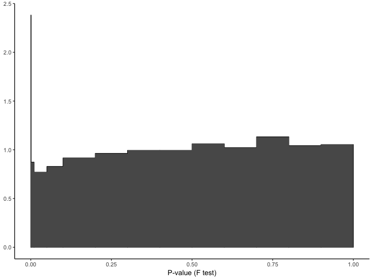
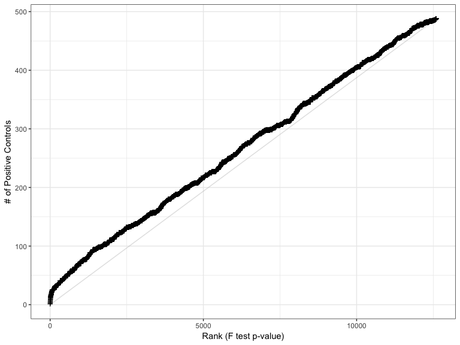
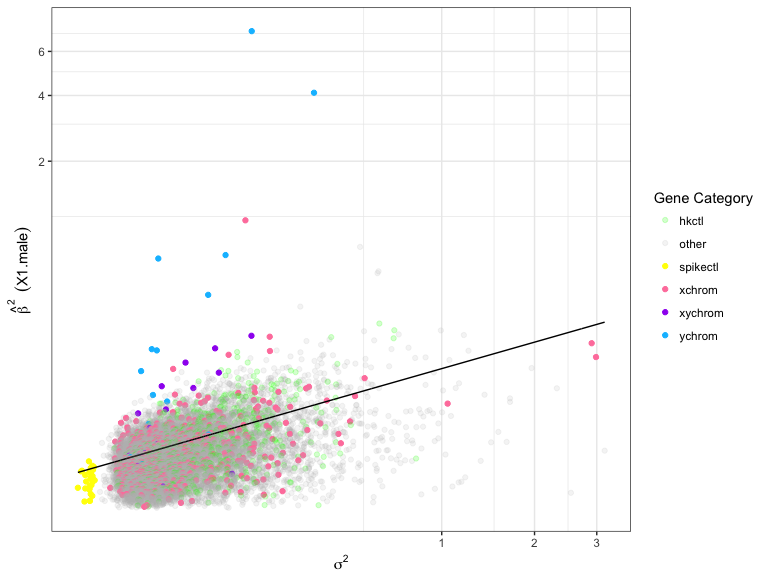
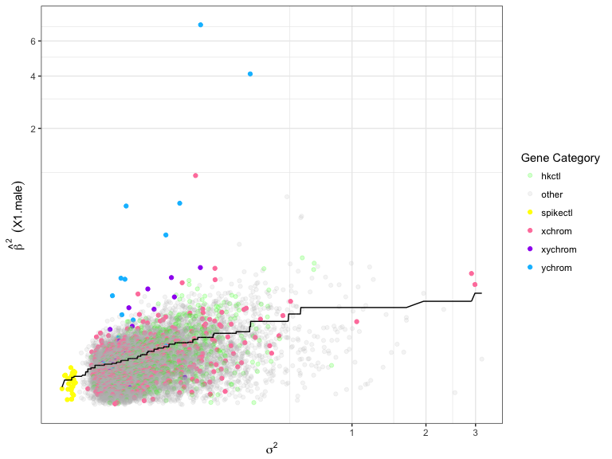
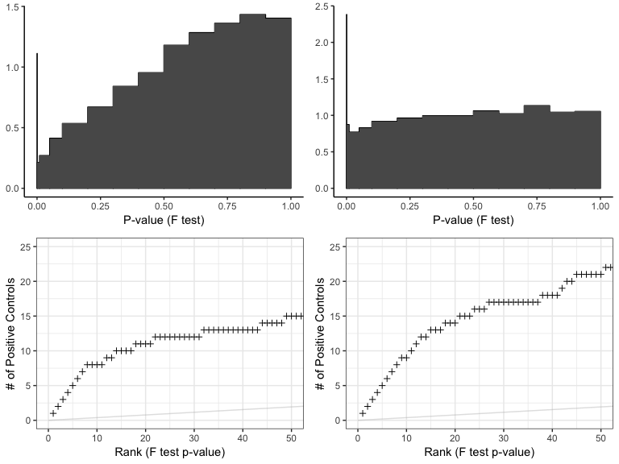
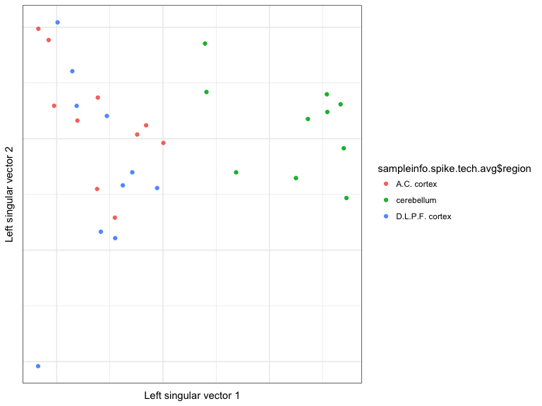
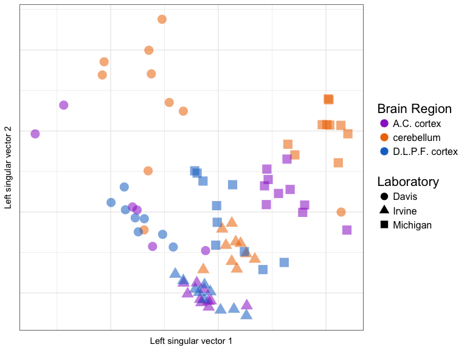
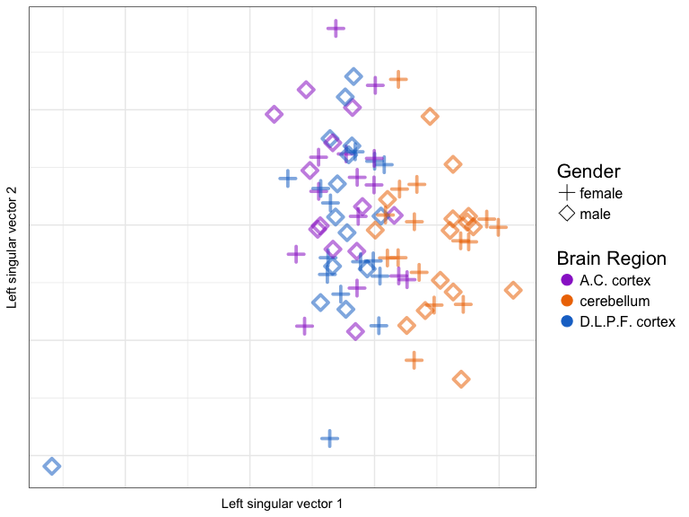
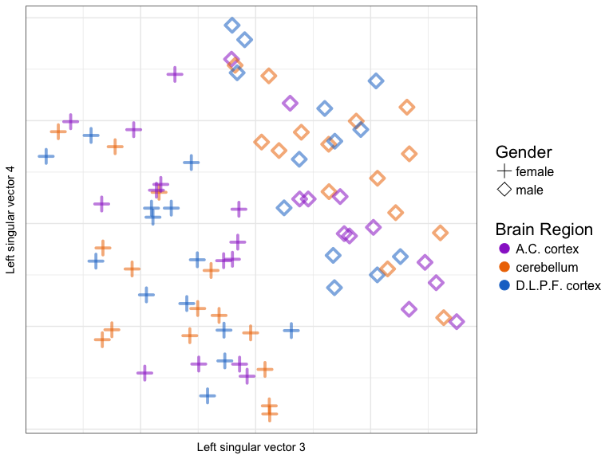
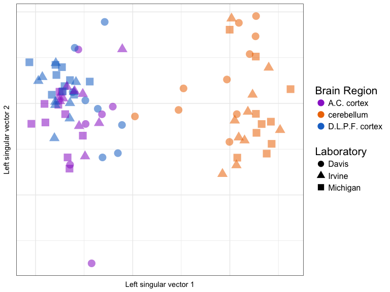

The RUV Package
================
useR! 2018 Brisbane

-   [Looking to clean your data? Learn how to Remove Unwanted Variation with R](#looking-to-clean-your-data-learn-how-to-remove-unwanted-variation-with-r)
-   [Example Analysis (Regression)](#example-analysis-regression)
-   [Did we help?](#did-we-help)
-   [Example Analyses (Global Adjustments)](#example-analyses-global-adjustments)
    -   [Example 1: Spike-in Negative Controls and Technical Replicates](#example-1-spike-in-negative-controls-and-technical-replicates)
    -   [Example 2: Plotting just the X/Y genes](#example-2-plotting-just-the-xy-genes)
    -   [Example 3: Just the X/Y genes, Continued](#example-3-just-the-xy-genes-continued)
    -   [Final Example](#final-example)
    -   [Examples with Shiny](#examples-with-shiny)
        -   [Balanced Design](#balanced-design)
        -   [Imbalanced Design](#imbalanced-design)
        -   [Brain Region](#brain-region)

Looking to clean your data? Learn how to Remove Unwanted Variation with R
=========================================================================

This notebook accompanies Session 1 Slides

``` r
> load("gender.rda")
> ls()
```

    ## [1] "geneinfo"   "sampleinfo" "Y.norm"     "Y.raw"

``` r
> # Y.raw: Summarized by RMA, but otherwise not preprocessed Y.norm:
> # Background corrected and quantile normalized
```

``` r
> Y = Y.norm
> Y[1:5, 1:5]
```

    ##                 1000_at  1001_at 1002_f_at 1003_s_at  1004_at
    ## 01_a_D_f_2.CEL 9.823395 6.258064  5.119432  7.053562 7.358204
    ## 01_a_I_f_2.CEL 9.598368 6.382745  5.052340  7.530220 7.244545
    ## 01_a_M_f_1.CEL 9.270307 5.633953  4.765587  7.695161 7.466540
    ## 01_c_D_f_1.CEL 8.180496 5.162317  4.653400  7.142755 6.679110
    ## 01_c_I_f_2.CEL 9.352611 6.569988  4.958501  7.460245 6.935908

``` r
> head(sampleinfo)
```

    ##                   patient gender      region      lab chip.version
    ## 01_a_D_f_2.CEL patient_01 female A.C. cortex    Davis           v2
    ## 01_a_I_f_2.CEL patient_01 female A.C. cortex   Irvine           v2
    ## 01_a_M_f_1.CEL patient_01 female A.C. cortex Michigan           v1
    ## 01_c_D_f_1.CEL patient_01 female  cerebellum    Davis           v1
    ## 01_c_I_f_2.CEL patient_01 female  cerebellum   Irvine           v2
    ## 01_c_M_f_1.CEL patient_01 female  cerebellum Michigan           v1

``` r
> head(geneinfo)
```

    ##           genetype     sym chrom hkctl spikectl  pctl
    ## 1000_at      other   MAPK3    16 FALSE    FALSE FALSE
    ## 1001_at      other    TIE1     1 FALSE    FALSE FALSE
    ## 1002_f_at    other CYP2C19    10 FALSE    FALSE FALSE
    ## 1003_s_at    other   CXCR5    11 FALSE    FALSE FALSE
    ## 1004_at      other   CXCR5    11 FALSE    FALSE FALSE
    ## 1005_at      other   DUSP1     5 FALSE    FALSE FALSE

``` r
> # Load the ruv package
> library(ruv)
> # Graphics
> library(ggplot2)
> library(gridExtra)
> gg_additions = list(aes(color = sampleinfo$region, shape = sampleinfo$lab, size = 5, 
+     alpha = 0.7), labs(color = "Brain Region", shape = "Laboratory"), scale_size_identity(guide = "none"), 
+     scale_alpha(guide = "none"), theme(legend.text = element_text(size = 12), 
+         legend.title = element_text(size = 16)), guides(color = guide_legend(override.aes = list(size = 4)), 
+         shape = guide_legend(override.aes = list(size = 4))), scale_color_manual(values = c("darkorchid3", 
+         "darkorange2", "dodgerblue3")))
> options(repr.plot.width = 8, repr.plot.height = 6)
```

``` r
> ruv_svdplot(Y) + gg_additions  # Technical note: centers columns by default
```


``` r
> ruv_svdplot(residop(scale(Y, scale = FALSE), svd(scale(Y, scale = FALSE))$u[, 
+     1:5])) + gg_additions
```


``` r
> ruv_svdplot(RUVIII(Y, replicate.matrix(sampleinfo[, c("patient", "region")]), 
+     geneinfo$spikectl, k = 10)) + gg_additions
```


Example Analysis (Regression)
=============================

``` r
> fit = RUVrinv(Y, sampleinfo$gender, geneinfo$spikectl)
> fit.summary = ruv_summary(Y, fit, sampleinfo, geneinfo)
> head(fit.summary$C)
```

    ##                   F.p       F.p.BH    p_X1.male p.BH_X1.male  b_X1.male
    ## 41214_at 1.000000e-24 1.000000e-24 1.000000e-24 1.000000e-24  2.6714931
    ## 37583_at 1.000000e-24 1.321247e-23 1.000000e-24 1.321247e-23  0.7328333
    ## 38355_at 1.000000e-24 2.757869e-21 1.000000e-24 2.757869e-21  2.0265366
    ## 38446_at 4.418298e-18 1.391764e-14 4.418298e-18 1.391764e-14 -0.9738340
    ## 35885_at 7.721272e-16 1.945760e-12 7.721272e-16 1.945760e-12  0.7532324
    ## 34477_at 2.796912e-12 5.873516e-09 2.796912e-12 5.873516e-09  0.5352809
    ##              sigma2 var.b_X1.male fit.ctl     mean genetype    sym chrom
    ## 41214_at 0.14089869   0.007423009   FALSE 6.964411   ychrom RPS4Y1     Y
    ## 37583_at 0.03176268   0.001673363   FALSE 7.050362   ychrom  KDM5D     Y
    ## 38355_at 0.29926305   0.015766168   FALSE 5.371231   ychrom  DDX3Y     Y
    ## 38446_at 0.12940226   0.006817339   FALSE 4.968191   xchrom   XIST     X
    ## 35885_at 0.09783492   0.005154268   FALSE 4.802025   ychrom  USP9Y     Y
    ## 34477_at 0.07529989   0.003967048   FALSE 4.966936   ychrom    UTY     Y
    ##          hkctl spikectl pctl
    ## 41214_at FALSE    FALSE TRUE
    ## 37583_at FALSE    FALSE TRUE
    ## 38355_at FALSE    FALSE TRUE
    ## 38446_at FALSE    FALSE TRUE
    ## 35885_at FALSE    FALSE TRUE
    ## 34477_at FALSE    FALSE TRUE

``` r
> ruv_hist(fit.summary)
```



``` r
> ruv_ecdf(fit.summary)
```


``` r
> ruv_ecdf(fit.summary, power = 1/4)
```


``` r
> genecoloring = list(aes(color = genetype), scale_color_manual(name = "Gene Category", 
+     values = alpha(c("green", "gray", "yellow", "palevioletred1", "purple", 
+         "deepskyblue"), c(0.2, 0.15, 1, 1, 1, 1))))
> 
> ruv_ecdf(fit.summary) + genecoloring
```


``` r
> ruv_rankplot(fit.summary, "pctl")  # 'pctl' is a column in 'geneinfo'.  Genes from X/Y chrom.
```



``` r
> ruv_rankplot(fit.summary, "pctl") + coord_cartesian(xlim = c(0, 50), ylim = c(0, 
+     25))
```


``` r
> ruv_projectionplot(fit.summary) + genecoloring
```


``` r
> ruv_volcano(fit.summary) + genecoloring
```


``` r
> ruv_varianceplot(fit.summary) + genecoloring
```



``` r
> fit.summary.evar = ruv_summary(Y, fit, sampleinfo, geneinfo, p.type = "evar")
> ruv_varianceplot(fit.summary.evar) + genecoloring
```



Did we help?
============

``` r
> # RUV4 with k = 0 for no adjustment Equivalent to a Limma Analysis
> fit.unadj = RUV4(Y, sampleinfo$gender, geneinfo$spikectl, 0)
> fit.summary.unadj = ruv_summary(Y, fit.unadj, sampleinfo, geneinfo)
> # Make a list of plots to compare side-by-side
> plots = list(ruv_hist(fit.summary.unadj), ruv_hist(fit.summary), ruv_rankplot(fit.summary.unadj, 
+     "pctl") + coord_cartesian(xlim = c(0, 50), ylim = c(0, 25)), ruv_rankplot(fit.summary, 
+     "pctl") + coord_cartesian(xlim = c(0, 50), ylim = c(0, 25)))
> 
> 
> grid.arrange(grobs = plots)
```



Example Analyses (Global Adjustments)
=====================================

Example 1: Spike-in Negative Controls and Technical Replicates
--------------------------------------------------------------

``` r
> ruv_svdplot(Y) + gg_additions
```


``` r
> M = replicate.matrix(sampleinfo[, c("patient", "region")])
> YIII.spike.tech = RUVIII(Y, M, geneinfo$spikectl, k = 10)
> 
> ruv_svdplot(YIII.spike.tech) + gg_additions
```


``` r
> # This time, set average=TRUE
> YIII.spike.tech.avg = RUVIII(Y, M, geneinfo$spikectl, k = 10, average = TRUE)
> # Create 'metadata' for the rows of YIII.spike.tech.avg
> sampleinfo.spike.tech.avg = collapse.replicates(sampleinfo, M)
> head(sampleinfo.spike.tech.avg)
```

    ##                               patient gender          region
    ## patient_01_A.C..cortex     patient_01 female     A.C. cortex
    ## patient_01_cerebellum      patient_01 female      cerebellum
    ## patient_01_D.L.P.F..cortex patient_01 female D.L.P.F. cortex
    ## patient_02_A.C..cortex     patient_02   male     A.C. cortex
    ## patient_02_cerebellum      patient_02   male      cerebellum
    ## patient_02_D.L.P.F..cortex patient_02   male D.L.P.F. cortex

``` r
> ruv_svdplot(YIII.spike.tech.avg) + aes(color = sampleinfo.spike.tech.avg$region)
```



Example 2: Plotting just the X/Y genes
--------------------------------------

``` r
> ruv_svdplot(Y[, geneinfo$pctl]) + gg_additions
```



``` r
> gg_gender_region = list(aes(color = sampleinfo$region, shape = sampleinfo$gender, 
+     size = 3, alpha = 1, stroke = 2), labs(color = "Brain Region", shape = "Gender"), 
+     scale_size_identity(guide = "none"), scale_alpha(guide = "none"), scale_shape_manual(values = c(male = 5, 
+         female = 3)), theme(legend.text = element_text(size = 12), legend.title = element_text(size = 16)), 
+     guides(color = guide_legend(override.aes = list(size = 4)), shape = guide_legend(override.aes = list(size = 4))), 
+     scale_color_manual(values = c("darkorchid3", "darkorange2", "dodgerblue3")))
> 
> ruv_svdplot(Y[, geneinfo$pctl]) + gg_gender_region
```


``` r
> ruv_svdplot(YIII.spike.tech[, geneinfo$pctl]) + gg_gender_region
```



Example 3: Just the X/Y genes, Continued
----------------------------------------

``` r
> M = replicate.matrix(sampleinfo[, c("patient")])
> YIII.hk.bio = RUVIII(Y, M, geneinfo$hkctl, k = 10)
> 
> ruv_svdplot(YIII.hk.bio[, geneinfo$pctl]) + gg_gender_region
```


``` r
> # Create a design matrix for brain region:
> region_mat = design.matrix(sampleinfo$region)
> # Regress it out from the 'technical-adjusted' dataset
> YIII.spike.tech.region_regression = residop(YIII.spike.tech, region_mat)
> 
> ruv_svdplot(YIII.spike.tech.region_regression[, geneinfo$pctl]) + gg_gender_region
```


``` r
> gg_gender_region_nooutlier = list(aes(color = sampleinfo$region[-15], shape = sampleinfo$gender[-15], 
+     size = 3, alpha = 1, stroke = 2), labs(color = "Brain Region", shape = "Gender"), 
+     scale_size_identity(guide = "none"), scale_alpha(guide = "none"), scale_shape_manual(values = c(male = 5, 
+         female = 3)), theme(legend.text = element_text(size = 12), legend.title = element_text(size = 16)), 
+     guides(color = guide_legend(override.aes = list(size = 4)), shape = guide_legend(override.aes = list(size = 4))), 
+     scale_color_manual(values = c("darkorchid3", "darkorange2", "dodgerblue3")))
> 
> ruv_svdplot(YIII.spike.tech.region_regression[-15, geneinfo$pctl]) + gg_gender_region_nooutlier
```


``` r
> ruv_svdplot(YIII.spike.tech.region_regression[-15, geneinfo$pctl], k = 3:4) + 
+     gg_gender_region_nooutlier
```



Final Example
-------------

``` r
> M = replicate.matrix(sampleinfo[, c("region")])
> newY3 = RUVIII(Y, M, geneinfo$hkctl, k = 10)
> 
> ruv_svdplot(newY3) + gg_additions
```



``` r
> M = replicate.matrix(sampleinfo[, c("region")], burst = c("cerebellum", "D.L.P.F..cortex"))
> newY3 = RUVIII(Y, M, geneinfo$hkctl, k = 10)
> 
> ruv_svdplot(newY3) + gg_additions
```


Examples with Shiny
-------------------

### Balanced Design

``` r
> library(ruv)
> library(shiny)
> library(colourpicker)
> load("gender.rda")
> Y = Y.norm
> ruv_shiny(Y, sampleinfo, geneinfo, options = list(port = 3840, host = "0.0.0.0"))
```

### Imbalanced Design

``` r
> keep = rep(T, nrow(Y))
> keep[sampleinfo$lab == "Davis" & sampleinfo$gender == "male"] = FALSE
> keep[sampleinfo$lab == "Michigan" & sampleinfo$gender == "female"] = FALSE
> Y.imb = Y[keep, ]
> sampleinfo.imb = sampleinfo[keep, ]
> ruv_shiny(Y.imb, sampleinfo.imb, geneinfo, options = list(port = 3840, host = "0.0.0.0"))
> 
> keep = rep(T, nrow(Y))
> keep[sampleinfo$lab == "Davis" & sampleinfo$gender == "male"] = FALSE
> keep[sampleinfo$lab == "Michigan" & sampleinfo$gender == "female"] = FALSE
> Y.imb = Y.raw[keep, ]
> sampleinfo.imb = sampleinfo[keep, ]
> ruv_shiny(Y.imb, sampleinfo.imb, geneinfo, options = list(port = 3840, host = "0.0.0.0"))
```

### Brain Region

``` r
> ruv_shiny(Y.raw, sampleinfo, geneinfo, options = list(port = 3840, host = "0.0.0.0"))
> 
> newY = RUVI(Y.raw, 1, geneinfo$spikectl)
> M = replicate.matrix(sampleinfo[, c("patient", "region")])
> newY = RUVIII(newY, M, geneinfo$spikectl, k = 4, average = TRUE)
> newsampleinfo = collapse.replicates(sampleinfo, M)
> fit = RUV4(newY, newsampleinfo$cortex, rep(TRUE, ncol(newY)), k = 1)
> fit = ruv_summary(newY, fit, newsampleinfo, geneinfo)
> 
> ruv_ecdf(fit, uniform.lines = seq(0, 1, by = 0.1))
> 
> mean(fit$C$F.p > 0.25)
> mean(fit$C$F.p.BH > 0.5)
> 
> ectl = colnames(newY) %in% rownames(fit$C)[fit$C$F.p.BH > 0.5]
> geneinfo = cbind(geneinfo, neg.cer = ectl)
> 
> ruv_shiny(Y.raw, sampleinfo, geneinfo)
```
