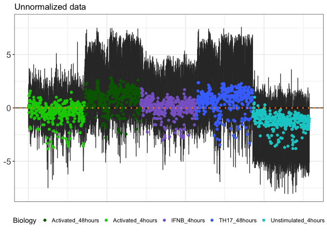
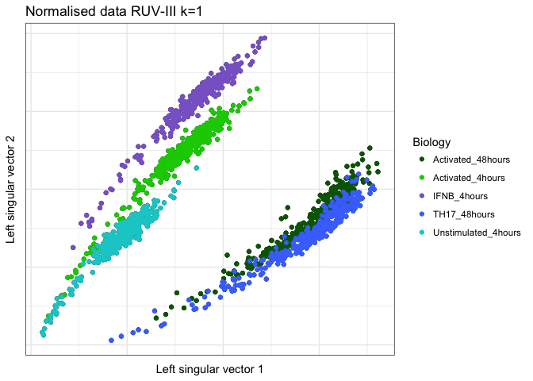
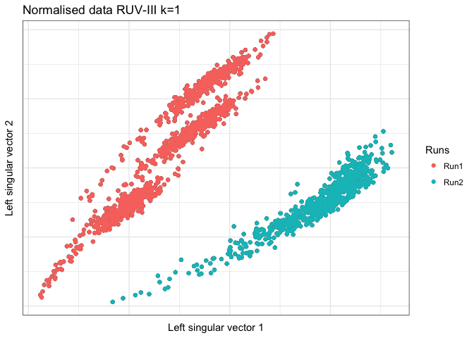
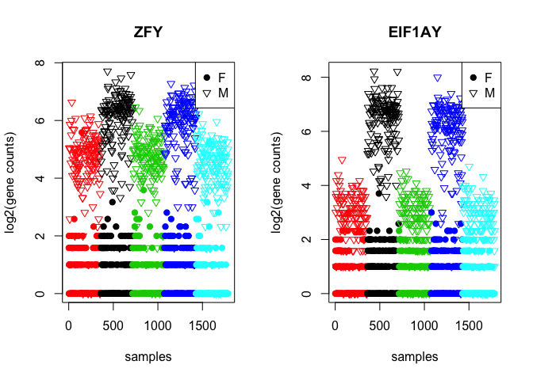
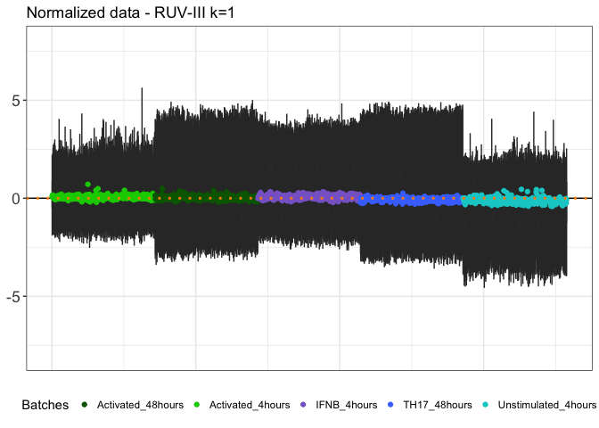
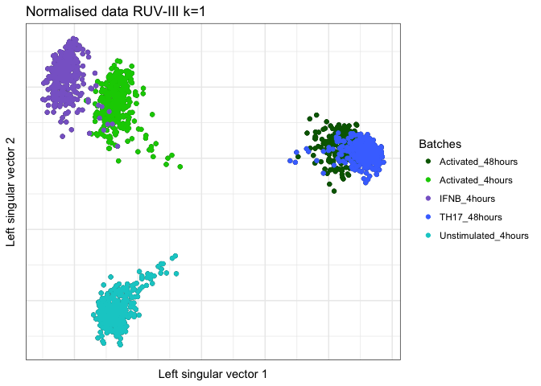
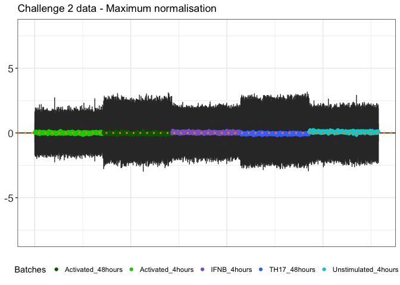
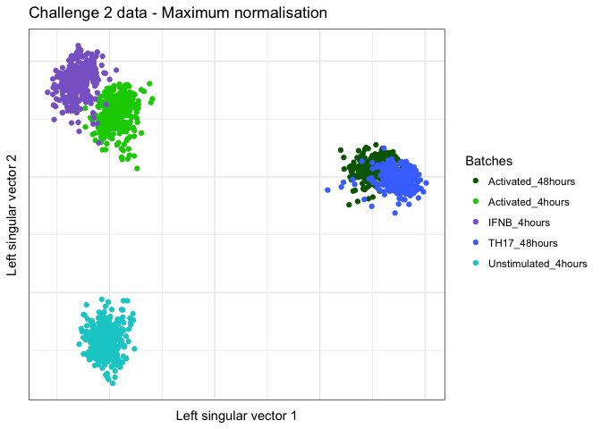

Challenges\_solutions
================
03/07/2018

-   [Challenge 1: Unnormalised data](#challenge-1-unnormalised-data)
    -   [Diagnostics to check if the data needs normalisation](#diagnostics-to-check-if-the-data-needs-normalisation)
        -   [RLE plot](#rle-plot)
        -   [PCA plot](#pca-plot)
        -   [Gender genes](#gender-genes)
        -   [Comments](#comments)
    -   [Let's normalise the data](#lets-normalise-the-data)
        -   [Diagnostics on the normalised data](#diagnostics-on-the-normalised-data)
        -   [Comments on the normalisation](#comments-on-the-normalisation)
-   [Challenge 2: Too much normalisation is bad!](#challenge-2-too-much-normalisation-is-bad)
    -   [Diagnostics to check if the data needs normalisation](#diagnostics-to-check-if-the-data-needs-normalisation-1)
        -   [RLE plot](#rle-plot-1)
        -   [PCA plot](#pca-plot-1)
        -   [Gender genes](#gender-genes-1)

Challenge 1: Unnormalised data
==============================

The data for this challenge is the raw gene expression before normalisation.

``` r
library(ruv)
library(matrixStats)
library(ggplot2)
```

-   Raw gene expression data

``` r
####### 
rawData <- read.csv('../Challenge1Data.csv', row.names = 1, as.is = TRUE, stringsAsFactors = FALSE)
rawData <- as.matrix(rawData)
dim(rawData) # 231 1788
```

    ## [1]  231 1788

``` r
kable(rawData[1:4,1:4])
```

|         |  Sample\_1|  Sample\_2|  Sample\_3|  Sample\_4|
|---------|----------:|----------:|----------:|----------:|
| ACTB    |  12.051549|  11.912141|  11.956739|  11.349281|
| AHR     |  10.049848|   9.902375|   9.961450|   9.290019|
| AIF1    |   3.000000|   2.000000|   3.700440|   3.321928|
| ALDH7A1 |   1.584963|   1.000000|   3.169925|   2.807355|

There are 231 genes and 1788 samples.

-   Samples information

There are 5 different biological conditions of interest which have been run in 2 different runs.

``` r
Info <- read.csv('../Challenge.information.csv', as.is = TRUE, stringsAsFactors = FALSE)
dim(Info) # 1788    3
```

    ## [1] 1788    4

``` r
kable(head(Info))
```

| SampleIds | Gender | Runs | Biology           |
|:----------|:-------|:-----|:------------------|
| Sample\_1 | female | Run1 | Activated\_4hours |
| Sample\_2 | female | Run1 | Activated\_4hours |
| Sample\_3 | female | Run1 | Activated\_4hours |
| Sample\_4 | female | Run1 | Activated\_4hours |
| Sample\_5 | female | Run1 | Activated\_4hours |
| Sample\_6 | male   | Run1 | Activated\_4hours |

Diagnostics to check if the data needs normalisation
----------------------------------------------------

### RLE plot

**Note on RLE**: a *bad looking* RLE plot is a symptom that the data are affected by batch effect but a *good looking* RLE plot does not necesserily mean that the data are normalised well and ready to use! RLE plots are only one of the possible ways to take into account when exploring the quality of the data.

``` r
ColorBatch <- c('darkgreen' , 'green3' , 'mediumpurple3' , 'royalblue1' , 'cyan3' )
ruv_rle(Y = t(rawData),ylim = c(-8 , 8),rowinfo = Info) + theme(legend.position = "bottom") + labs(colour="Biology") + geom_point(aes(x = rle.x.factor,y= middle,colour=Biology)) +
       scale_color_manual(values=ColorBatch) + geom_hline(yintercept = 0,linetype="dotted",colour="darkorange",size=1)+ggtitle('Unnormalized data')
```



### PCA plot

``` r
ColorBatch <- c('darkgreen' , 'green3' , 'mediumpurple3' , 'royalblue1' , 'cyan3' )
ruv_svdplot(t(rawData), k = c(1,2),info = Info) + geom_point(aes(color=Biology)) +
 scale_color_manual(values=ColorBatch) + labs(color="Biology") +ggtitle("Normalised data RUV-III k=1")
```



``` r
ruv_svdplot(t(rawData), k = c(1,2),info = Info) + geom_point(aes(color=Runs)) +   labs(color="Runs")+ggtitle("Normalised data RUV-III k=1")
```



### Gender genes

We refer to gender genes as to genes that are well known to be differentially expressed between males and females, usually expressed only in females or males. For example, genes on the Y chromosome should not be found expressed in females. If these expectations are not met, then there might be problems in how the data have been normalised or in how information about samples have been recorded.

We often use gender genes as a way to check if the normalisation has worked properly. We expect biology to be preserved between males and females.

``` r
par(mfrow = c(1,2))
controlSex <-c('ZFY', 'EIF1AY')

for(i in 1:2){
  
  plot(rawData[ controlSex[i] , ], col = factor(Info$Biology),
       pch = c(19,6)[factor(Info$Gender)],main=controlSex[i],ylab="log2(gene counts)",xlab="samples")
  legend("topright",legend=c("F","M"),pch=c(19,6))
  
}
```



At this point we have no information whether the expression of these genes in males should be constant across conditions. We only know how the expression should differ between females and males. From our knowledge about these two genes, we know that they should not be expressed in females. Indeed, this is observed in the plots above.

### Comments

The three diagnostic plots above are useful tools to detect possible batch effect in the data. Out of the three of them, the RLE plot clearly shows major shifts from what would be expected if the data were not affected by batch effect. The PCA plot distinguishes between biological conditions but since we have a confounding effect we caannot say how much is driven by biology or bacth effect. From the gender plots we are not able to tell if the fluctuations of gene expression between batches in males is due to batch effect or biology but we can only confirm that these genes are not expressed in females.

It is worth trying to normalise the data!

Let's normalise the data
------------------------

A very important and critical step in using the RUV-III method to normalise the data is to find a suitable set of negative control genes. Below, we provide a set of 100 carefully selected negative control genes.

``` r
M <- replicate.matrix(Info$SampleIds)
dim(M)
```

    ## [1] 1788 1742

``` r
Con100 <- readRDS('../controlGene100.rds')
length(Con100)
```

    ## [1] 100

``` r
C100 <- row.names(rawData) %in% Con100

RUVCorrected <- RUVIII(Y = t(rawData), ctl = C100 , M = M, k = 1)
```

    ## Warning in RUVIII(Y = t(rawData), ctl = C100, M = M, k = 1): m is greater
    ## than n! This is not a problem itself, but may indicate that you need
    ## to transpose your data matrix. Please ensure that rows correspond to
    ## observations (e.g. microarrays) and columns correspond to features (e.g.
    ## genes).

### Diagnostics on the normalised data

``` r
ColorBatch <- c('darkgreen' , 'green3' , 'mediumpurple3' , 'royalblue1' , 'cyan3' )
ruv_rle(Y = RUVCorrected,ylim = c(-8 , 8),rowinfo = Info) + geom_point(aes(x = rle.x.factor,y= middle,colour=Biology)) + theme(legend.position = "bottom") + labs(colour="Batches") +
       scale_color_manual(values=ColorBatch) + geom_hline(yintercept = 0,linetype="dotted",colour="darkorange",size=1)+ggtitle('Normalized data - RUV-III k=1')
```



``` r
ColorBatch <- c('darkgreen' , 'green3' , 'mediumpurple3' , 'royalblue1' , 'cyan3' )
ruv_svdplot(RUVCorrected, k = c(1,2),info = Info) + geom_point(aes(color=Biology)) + 
scale_color_manual(values=ColorBatch) + labs(color="Batches") + ggtitle("Normalised data RUV-III k=1")
```



``` r
par(mfrow = c(1,2))
controlSex <-c('ZFY', 'EIF1AY')

for(i in 1:2){
  plot(t(RUVCorrected)[ controlSex[i] , ], col = factor(Info$Biology),
       pch = c(19,6)[factor(Info$Gender)],main=controlSex[i],ylab="log(gene counts)",xlab="samples")
  legend("topright",legend=c("F","M"),pch=c(19,6))
}
```


### Comments on the normalisation

1.  The RLE plot looks way better, the median values are all pretty much zero and the interquartile ranges are narrower.
2.  The PCA plot shows a better separation between biologys than in the raw data
3.  The plot for gender genes shows differences between males and females are preserved. The gene expressions of female samples show only slight fluctuations between batches.

The fluctuations in gene expression of gene EIF1AY between conditions in males could be validated by comparing with a set of independent data where the gene expression of a subset of the same samples was assessed all in one batch.

Challenge 2: Too much normalisation is bad!
===========================================

The data provided in this challenge is exactly the same as in the previous one. The only difference is that these data had already been normalised using the maximum number of k (maximum normalisation possible) and using all genes as negative control genes. In details, the code below was used to generate `Challenge2Data.csv`.

``` r
rawData <- read.csv('../Challenge1Data.csv', row.names = 1, as.is = TRUE, stringsAsFactors = FALSE)
rawData <- as.matrix(rawData)

Info <- read.csv('../Challenge.information.csv', as.is = TRUE, stringsAsFactors = FALSE)


RUVtoo <- RUVIII(Y = t(rawData), ctl = c(1:nrow(rawData)) , M = M, k = 46)

write.csv(t(RUVtoo),"../Challenge2Data.csv",row.names = TRUE)
```

``` r
challenge2 <- read.csv("../Challenge2Data.csv", row.names = 1, as.is = TRUE, stringsAsFactors = FALSE)
challenge2 <- as.matrix(challenge2)
```

Diagnostics to check if the data needs normalisation
----------------------------------------------------

### RLE plot

The RLE plot looks good!

``` r
ColorBatch <- c('darkgreen' , 'green3' , 'mediumpurple3' , 'royalblue1' , 'cyan3' )
ruv_rle(Y = t(challenge2),ylim = c(-8 , 8),rowinfo = Info) + geom_point(aes(x = rle.x.factor,y= middle,colour=Biology)) + theme(legend.position = "bottom") + labs(colour="Batches") +
       scale_color_manual(values=ColorBatch) + geom_hline(yintercept = 0,linetype="dotted",colour="darkorange",size=1)+ggtitle('Challenge 2 data - Maximum normalisation')
```



### PCA plot

The PCA distinguish between biological conditions. It looks good.

``` r
ColorBatch <- c('darkgreen' , 'green3' , 'mediumpurple3' , 'royalblue1' , 'cyan3' )
ruv_svdplot(t(challenge2), k = c(1,2),info = Info) + list(aes(color=Biology), 
scale_color_manual(values=ColorBatch), labs(color="Batches") ) + ggtitle("Challenge 2 data - Maximum normalisation")
```



### Gender genes

This is when we realise that the over-correction caused some problem to the biology. ZFY expression among females largely fluctuates and in some conditions (black and blue dots) genes that should have no expression could actually be wrongly seen as expressed. In the EIF1AY gene we don't see any more the separation between females and males expression for the red, green and cyan conditions.

This shows that even though PCA and RLE plots woud suggest that the data are normalised, one should always be extremely careful in checking that the biology in the data is preserved as expected. This is done by using what we call **positive control** genes that like the gender genes below, we know how they should behave.

``` r
par(mfrow = c(1,2))
controlSex <-c('ZFY', 'EIF1AY')

for(i in 1:2){
  plot(challenge2[ controlSex[i] , ], col = factor(Info$Biology),
       pch = c(19,6)[factor(Info$Gender)],main=controlSex[i],ylab="log(gene counts)",xlab="samples")
    legend("topright",legend=c("F","M"),pch=c(19,6))
}
```


