How to remove unwanted variations from transcriptomics data using RUVinv and RUV4
================
true

-   [Data description](#data-description)
-   [Assessment of unwanted variations in the data.](#assessment-of-unwanted-variations-in-the-data.)
    -   [RLE plot](#rle-plot)
    -   [PCA plot](#pca-plot)
-   [Remove batch effects using RUVinv](#remove-batch-effects-using-ruvinv)
-   [Comparison of RUVinv method with RUV4 method](#comparison-of-ruvinv-method-with-ruv4-method)
    -   [Betahat correlation](#betahat-correlation)
    -   [Overlap between differential expressed genes obtained with RUVinv and RUV4](#overlap-between-differential-expressed-genes-obtained-with-ruvinv-and-ruv4)
    -   [Overlap between differential expressed genes obtained across samples](#overlap-between-differential-expressed-genes-obtained-across-samples)

In this tutorial, we aim to normalise an integrated data generated by combining 10 microarray studies on control samples to and TGFb-treated samples extracted from this publication (Foroutan S. et al, "A Transcriptional Program for Detecting TGFβ-Induced EMT in Cancer", Molecular Cancer Research, 2017) that can be found here: [http://mcr.aacrjournals.org/content/15/5/619.long.\\](http://mcr.aacrjournals.org/content/15/5/619.long.\)

We first assess the presence of unwanted variations in the integrated data which combines differents studies and platforms. Second we show how to use two RUV methods: RUVinv and RUV4 to remove this unwanted variation and detect differential expressed genes comparing control samples to and TGFb-treated samples. Third we assess whether RUV methods are useful and compare the results obtained by each method.

Data description
================

``` r
library(ruv)
library(limma)          ## for DE analysis
#library(sva)            ## for performing ComBat and SVA
library(ruv)            ## for performing RUV
#library(NMF)            ## for drawing heatmaps
library(matrixStats)   
library(RColorBrewer)   ## for brewer.pal()
library(scales)         ## for alpha()
```

Add a sub-directory to save the output of the analysis.

``` r
mainPath <- getwd()
dir.create(file.path(mainPath, "out"), showWarnings = FALSE)
out_path <- "./out/"
```

We will be looking at two datasets sample A and sample B in this tutorial, each containing different platforms and studies. We will normalise them separately in order to compare the results obtained by the two normalisation methods.

Read in the integrated dataset:

``` r
samplesA<- read.table("expr_10data_sampleA.txt", header = T, sep = "\t")
samplesB<- read.table("expr_10data_sampleB.txt", header = T, sep = "\t")
```

Look at the data in each sample A and B:

``` r
head(samplesA,3)
```

    ##   EntrezID D_Ctrl_R1 D_TGFb_R1 D_Ctrl_R2 D_TGFb_R2 Hes_Ctrl_R1 Hes_TGFb_R1
    ## 1        2  4.182898  4.234204  4.271958  4.221931    6.212082    6.307131
    ## 2        9  5.763352  6.063185  5.698005  5.856127    8.136114    8.511206
    ## 3       10  4.467305  4.427406  4.403148  4.432531    4.746120    4.690118
    ##   Hes_Ctrl_R2 Hes_TGFb_R2 Hil_Ctrl_R1 Hil_Ctrl_R2 Hil_Ctrl_R3 Hil_TGFb_R1
    ## 1    6.127601    6.147889    5.506770    5.553145    5.479789    5.569616
    ## 2    8.454491    8.423706    6.624455    6.918824    6.689678    6.857544
    ## 3    4.655949    4.599947    5.634859    5.713780    5.587489    5.643846
    ##   Hil_TGFb_R2 Hil_TGFb_R3 M_Ctrl_R1 M_Ctrl_R2 M_Ctrl_R3 M_TGFb_R1
    ## 1    5.671409    5.573899  4.560858  4.403457  4.319724  4.744270
    ## 2    6.844987    6.896004  4.416877  4.319870  4.393092  4.544959
    ## 3    5.714321    5.629158  4.093639  4.033749  4.032735  4.023618
    ##   M_TGFb_R2 M_TGFb_R3 K_Ctrl_R1 K_Ctrl_R2 K_Ctrl_R3 K_TGFb_R1 K_TGFb_R2
    ## 1  4.588234  4.584527  4.777384  4.917127  4.858409  4.937631  5.168482
    ## 2  4.458979  4.396294  7.988627  7.962891  8.171779  8.057742  8.042637
    ## 3  4.158607  4.212378  4.998611  5.313192  4.930239  4.887161  4.924362
    ##   K_TGFb_R3 S_A_Ctrl_R1 S_A_Ctrl_R2 S_A_Ctrl_R3 S_A_TGFb_R1 S_A_TGFb_R2
    ## 1  5.194140    3.476009    3.507338    3.286060    3.113494    3.385346
    ## 2  8.080908    7.966643    7.958268    7.978372    8.065126    8.222971
    ## 3  4.828075    4.245783    4.266803    4.038102    4.635477    4.422005
    ##   S_A_TGFb_R3
    ## 1    3.111588
    ## 2    8.054848
    ## 3    4.507648

``` r
head(samplesB,3)
```

    ##   EntrezID S_HCC_Ctrl_R1 S_HCC_Ctrl_R2 S_HCC_Ctrl_R3 S_HCC_TGFb_R1
    ## 1        2      3.378005      3.441901      3.658986      3.562072
    ## 2        9      9.808725      9.850605      9.855069      8.562214
    ## 3       10      4.611709      4.718516      4.835701      4.648048
    ##   S_HCC_TGFb_R2 S_HCC_TGFb_R3 S_NCI_Ctrl_R1 S_NCI_Ctrl_R2 S_NCI_Ctrl_R3
    ## 1      3.592344      3.752616      5.123849      5.170630      5.150285
    ## 2      8.446298      8.326317      8.023910      8.085010      7.879816
    ## 3      4.624559      4.672416      5.647240      5.581731      5.524096
    ##   S_NCI_TGFb_R1 S_NCI_TGFb_R2 S_NCI_TGFb_R3 T_Ctrl1_R1 T_Ctrl1_R2
    ## 1      5.087718      4.802983      4.539320   4.881446   4.957741
    ## 2      7.420857      7.400648      7.369982   8.950682   8.869001
    ## 3      5.564654      5.515069      5.345369   5.057659   5.028980
    ##   T_Ctrl1_R3 T_TGFb_R1 T_TGFb_R2 T_TGFb_R3 T_Ctrl2_R1 T_Ctrl2_R2
    ## 1   4.957741  5.021006  4.957741  4.874664   5.134511   4.957741
    ## 2   8.827853  8.827853  8.834212  8.835467   8.506163   8.616943
    ## 3   5.196755  5.141569  5.059402  5.062695   5.196449   5.233412
    ##   T_Ctrl2_R3 W_Ctrl_R1 W_Ctrl_R2 W_Ctrl_R3 W_TGFb_R1 W_TGFb_R2 W_TGFb_R3
    ## 1   5.099819  3.092686  3.522515  3.116518  2.961264  3.095648  3.077959
    ## 2   8.552184  5.235870  5.431020  5.040574  5.476287  5.511955  5.123399
    ## 3   5.183326  3.087465  3.150153  3.270087  3.178776  3.178776  3.127422

``` r
mA<-samplesA[,2:dim(samplesA)[2]]
mB<-samplesB[,2:dim(samplesB)[2]]
row.names(mA)<- samplesA[,1]
row.names(mB)<- samplesB[,1]
mA<- as.matrix(mA)
mB<- as.matrix(mB)
```

Look at the information related to each sample including the name of the studies, type of platforms, treatment, and tissue types:

``` r
info_samplesA<- read.table("info_10data_sampleA.txt", sep="\t", header=T)
info_samplesA
```

    ##        samples      study treatment      platform    tissue
    ## 1    D_Ctrl_R1   Deshiere      Ctrl       Agilent    Breast
    ## 2    D_TGFb_R1   Deshiere      TGFb       Agilent    Breast
    ## 3    D_Ctrl_R2   Deshiere      Ctrl       Agilent    Breast
    ## 4    D_TGFb_R2   Deshiere      TGFb       Agilent    Breast
    ## 5  Hes_Ctrl_R1    Hesling      Ctrl HG_U133_Plus2    Breast
    ## 6  Hes_TGFb_R1    Hesling      TGFb HG_U133_Plus2    Breast
    ## 7  Hes_Ctrl_R2    Hesling      Ctrl HG_U133_Plus2    Breast
    ## 8  Hes_TGFb_R2    Hesling      TGFb HG_U133_Plus2    Breast
    ## 9  Hil_Ctrl_R1      Hills      Ctrl      Illumina    Kidney
    ## 10 Hil_Ctrl_R2      Hills      Ctrl      Illumina    Kidney
    ## 11 Hil_Ctrl_R3      Hills      Ctrl      Illumina    Kidney
    ## 12 Hil_TGFb_R1      Hills      TGFb      Illumina    Kidney
    ## 13 Hil_TGFb_R2      Hills      TGFb      Illumina    Kidney
    ## 14 Hil_TGFb_R3      Hills      TGFb      Illumina    Kidney
    ## 15   M_Ctrl_R1     Maupin      Ctrl HG_U133_Plus2 Pancrease
    ## 16   M_Ctrl_R2     Maupin      Ctrl HG_U133_Plus2 Pancrease
    ## 17   M_Ctrl_R3     Maupin      Ctrl HG_U133_Plus2 Pancrease
    ## 18   M_TGFb_R1     Maupin      TGFb HG_U133_Plus2 Pancrease
    ## 19   M_TGFb_R2     Maupin      TGFb HG_U133_Plus2 Pancrease
    ## 20   M_TGFb_R3     Maupin      TGFb HG_U133_Plus2 Pancrease
    ## 21   K_Ctrl_R1 Keshamouni      Ctrl HG_U133_Plus2      Lung
    ## 22   K_Ctrl_R2 Keshamouni      Ctrl HG_U133_Plus2      Lung
    ## 23   K_Ctrl_R3 Keshamouni      Ctrl HG_U133_Plus2      Lung
    ## 24   K_TGFb_R1 Keshamouni      TGFb HG_U133_Plus2      Lung
    ## 25   K_TGFb_R2 Keshamouni      TGFb HG_U133_Plus2      Lung
    ## 26   K_TGFb_R3 Keshamouni      TGFb HG_U133_Plus2      Lung
    ## 27 S_A_Ctrl_R1   Sun_A549      Ctrl HG_U133_Plus2      Lung
    ## 28 S_A_Ctrl_R2   Sun_A549      Ctrl HG_U133_Plus2      Lung
    ## 29 S_A_Ctrl_R3   Sun_A549      Ctrl HG_U133_Plus2      Lung
    ## 30 S_A_TGFb_R1   Sun_A549      TGFb HG_U133_Plus2      Lung
    ## 31 S_A_TGFb_R2   Sun_A549      TGFb HG_U133_Plus2      Lung
    ## 32 S_A_TGFb_R3   Sun_A549      TGFb HG_U133_Plus2      Lung

``` r
info_samplesB<- read.table("info_10data_sampleB.txt", sep="\t", header=T)
info_samplesB
```

    ##          samples   study treatment      platform tissue
    ## 1  S_HCC_Ctrl_R1 Sun_HCC      Ctrl HG_U133_Plus2   Lung
    ## 2  S_HCC_Ctrl_R2 Sun_HCC      Ctrl HG_U133_Plus2   Lung
    ## 3  S_HCC_Ctrl_R3 Sun_HCC      Ctrl HG_U133_Plus2   Lung
    ## 4  S_HCC_TGFb_R1 Sun_HCC      TGFb HG_U133_Plus2   Lung
    ## 5  S_HCC_TGFb_R2 Sun_HCC      TGFb HG_U133_Plus2   Lung
    ## 6  S_HCC_TGFb_R3 Sun_HCC      TGFb HG_U133_Plus2   Lung
    ## 7  S_NCI_Ctrl_R1 Sun_NCI      Ctrl HG_U133_Plus2   Lung
    ## 8  S_NCI_Ctrl_R2 Sun_NCI      Ctrl HG_U133_Plus2   Lung
    ## 9  S_NCI_Ctrl_R3 Sun_NCI      Ctrl HG_U133_Plus2   Lung
    ## 10 S_NCI_TGFb_R1 Sun_NCI      TGFb HG_U133_Plus2   Lung
    ## 11 S_NCI_TGFb_R2 Sun_NCI      TGFb HG_U133_Plus2   Lung
    ## 12 S_NCI_TGFb_R3 Sun_NCI      TGFb HG_U133_Plus2   Lung
    ## 13    T_Ctrl1_R1   Taube      Ctrl   HT_HG_U133A Breast
    ## 14    T_Ctrl1_R2   Taube      Ctrl   HT_HG_U133A Breast
    ## 15    T_Ctrl1_R3   Taube      Ctrl   HT_HG_U133A Breast
    ## 16     T_TGFb_R1   Taube      TGFb   HT_HG_U133A Breast
    ## 17     T_TGFb_R2   Taube      TGFb   HT_HG_U133A Breast
    ## 18     T_TGFb_R3   Taube      TGFb   HT_HG_U133A Breast
    ## 19    T_Ctrl2_R1   Taube      Ctrl   HT_HG_U133A Breast
    ## 20    T_Ctrl2_R2   Taube      Ctrl   HT_HG_U133A Breast
    ## 21    T_Ctrl2_R3   Taube      Ctrl   HT_HG_U133A Breast
    ## 22     W_Ctrl_R1   Walsh      Ctrl    HG_U133A_2 Kidney
    ## 23     W_Ctrl_R2   Walsh      Ctrl    HG_U133A_2 Kidney
    ## 24     W_Ctrl_R3   Walsh      Ctrl    HG_U133A_2 Kidney
    ## 25     W_TGFb_R1   Walsh      TGFb    HG_U133A_2 Kidney
    ## 26     W_TGFb_R2   Walsh      TGFb    HG_U133A_2 Kidney
    ## 27     W_TGFb_R3   Walsh      TGFb    HG_U133A_2 Kidney

Assessment of unwanted variations in the data.
==============================================

Here we perform some exploratory analysis on the integrated data to assess the amount of unwanted variation present in each dataset.

RLE plot
--------

We start by looking at the RLE plot on sample A by studies and by platform:

``` r
YA=t(mA)
### Plot RLE per study
ruv_rle(YA,info_samplesA$study,ylim = c(-4,4))
```


``` r
### Plot RLE per platform
ruv_rle(YA,info_samplesA$platform,ylim = c(-4,4))
```


Similarly, we look at the RLE plot on sample B by studies and by platform:

``` r
YB=t(mB)
### Plot RLE per study
ruv_rle(YB,info_samplesB$study,ylim = c(-4,4))
```


``` r
### Plot RLE per platform
ruv_rle(YB,info_samplesB$platform,ylim = c(-4,4))
```


PCA plot
--------

In transcriptomics applications, one of the most utilized exploratory plots is the multi-dimensional scaling (MDS) plot or a principal component analysis (PCA) plot. To assess the presence of unwanted variation in each sample, we use PCA plots to show similarities between samples measured in an unsupervised way. In transcriptomics, distances between samples are calculated based on the expression of the top varying genes. Ideally, samples should cluster well within the same treatment but we can identify in our PCA plot the unwanted variation as samples rather cluster by studies in both sample A and B.
In the current example, it's important to note that in a few cases the platforms and studies are confounded, and therefore there is no way to identify how much of the unwanted variation come from the study and how much come from the platform. Such situations must be avoided when designing an experiment and for the purpose of this tutorial, we only consider "study" as the true source of variation.

``` r
library(ggplot2)
library(gridExtra)
gg_additions = list(aes(color=info_samplesA$study,shape=info_samplesA$treatment,size=5, alpha=.7),
labs(color="Study",shape="Treatment"),
scale_size_identity(guide="none"),
scale_alpha(guide="none"),
theme(legend.text=element_text(size=12),
legend.title=element_text(size=16)),
guides(color = guide_legend(override.aes = list(size = 4)),
shape = guide_legend(override.aes = list(size = 4)))
#scale_color_manual(values=c("darkorchid3", "darkorange2","dodgerblue3")
)
options(repr.plot.width=8, repr.plot.height=6)
ruv_svdplot(YA) + gg_additions #
```


``` r
library(ggplot2)
library(gridExtra)
gg_additions = list(aes(color=info_samplesB$study,shape=info_samplesB$treatment,size=5, alpha=.7),
labs(color="Study",shape="Treatment"),
scale_size_identity(guide="none"),
scale_alpha(guide="none"),
theme(legend.text=element_text(size=12),
legend.title=element_text(size=16)),
guides(color = guide_legend(override.aes = list(size = 4)),
shape = guide_legend(override.aes = list(size = 4)))
#scale_color_manual(values=c("darkorchid3", "darkorange2","dodgerblue3")
)
options(repr.plot.width=8, repr.plot.height=6)
ruv_svdplot(YB) + gg_additions #
```


Remove batch effects using RUVinv
=================================

There are several RUV methods for removing unwanted variations in order to obtain DEGs; these include RUV-1, RUV-2, RUV-4, RUV-inv and RUV-rinv. In general, RUV methods are dependent on negative control genes (genes which are not associated with the biological factor of interest) and replicate samples (if applicable). RUV-2 removes unwanted variations in two steps. RUV-4 came after RUV-2 and has four steps. For RUV-4 we need to estimate the number of unwanted variations (k), while for RUV-inv and RUV-rinv we don't need to estimate k as it is set to be maximum. In general, RUV-inv and RUV-rinv are better than RUV-4. RUV-inv is recommended when we have large number of control genes (~1000), while RUV-rinv is more appropriate with small number of control genes (~60). The negative control genes can be the housekeeping (HK) genes or emprical control genes.
Here, we first focus on RUV-inv, which is performed by **RUVinv()** function. This function take expression matrix (Y), biological factor of interest (X), and a vector for indices of negative control genes (ctl).
We load **ruv** package first and then we the list of housekeeping (HK) genes.

``` r
# library(ruv)
HKgenes<- read.table("HouseKeeping_genes_IDs.txt", header=T, sep="\t")
hk<- HKgenes$GeneID
matA<- t(mA)
matB<- t(mB)
ctrl<- colnames(matA) %in% hk
```

We use these HK genes to perform RUV-inv and to obtain some statistics, from which we selected the genes that are mostly stable across the samples as the **empirical negative control genes** for sample A:

``` r
 ## take treatment as the biological factor of interest
groups_A<- factor(info_samplesA$treatment) 
gA<- cbind(as.numeric(groups_A))
## Apply RUV-inv using the housekeeping genes as negative controls to define new empirical controls genes
fit_samplesA=RUVinv(YA,gA,ctrl)
fit_samplesA.summary=ruv_summary(YA,fit_samplesA,info_samplesA)
head(fit_samplesA.summary$C)
```

    ##                F.p       F.p.BH         p_X1      p.BH_X1     b_X1
    ## 56937 1.469636e-18 1.748867e-14 1.469636e-18 1.748867e-14 2.168560
    ## 1277  6.229333e-18 2.541639e-14 6.229333e-18 2.541639e-14 2.431418
    ## 7045  6.407493e-18 2.541639e-14 6.407493e-18 2.541639e-14 1.625740
    ## 81029 1.649278e-17 4.906602e-14 1.649278e-17 4.906602e-14 2.005119
    ## 5654  2.934959e-17 6.985201e-14 2.934959e-17 6.985201e-14 1.831225
    ## 7052  5.644064e-17 1.119406e-13 5.644064e-17 1.119406e-13 2.262390
    ##            sigma2    var.b_X1 fit.ctl      mean
    ## 56937 0.009645147 0.004443795   FALSE 10.193047
    ## 1277  0.014084849 0.006489293   FALSE  8.060318
    ## 7045  0.006315495 0.002909729   FALSE 13.253531
    ## 81029 0.010599568 0.004883525   FALSE  6.893005
    ## 5654  0.009387898 0.004325273   FALSE  9.709266
    ## 7052  0.015340890 0.007067987   FALSE  9.617799

``` r
### Selecting empirical negative controls genes
cGenes_samplesA <- row.names(fit_samplesA.summary$C)[fit_samplesA.summary$C$F.p.BH>0.05]  
empCtrl_ruvinv_samplesA<- colnames(matA) %in% cGenes_samplesA
Gene_Category=empCtrl_ruvinv_samplesA
Gene_Category[empCtrl_ruvinv_samplesA==T]="EmpCt"
Gene_Category[empCtrl_ruvinv_samplesA==F]="Non_EmpCt"
Emp_Ct_Genes_samplesA=data.frame(geneids=colnames(matA),empCt_RUV=empCtrl_ruvinv_samplesA,Categ=Gene_Category)
length(cGenes_samplesA)
```

    ## [1] 7916

And similarly for sample B:

``` r
 ## take treatment as the biological factor of interest
groups_B<- factor(info_samplesB$treatment) 
gB<- cbind(as.numeric(groups_B))
## Apply RUV-inv using the housekeeping genesas negative controls to define new empirical controls genes
fit_samplesB=RUVinv(YB,gB,ctrl)
fit_samplesB.summary=ruv_summary(YB,fit_samplesB,info_samplesB)
head(fit_samplesB.summary$C)
```

    ##                F.p       F.p.BH         p_X1      p.BH_X1      b_X1
    ## 928   4.912988e-15 2.189772e-11 4.912988e-15 2.189772e-11 -2.337203
    ## 54502 5.601676e-15 2.189772e-11 5.601676e-15 2.189772e-11 -1.843358
    ## 26585 6.044283e-15 2.189772e-11 6.044283e-15 2.189772e-11  2.929713
    ## 7045  7.360577e-15 2.189772e-11 7.360577e-15 2.189772e-11  1.922368
    ## 2200  4.927187e-14 1.172670e-10 4.927187e-14 1.172670e-10  2.344241
    ## 2335  9.071491e-14 1.799179e-10 9.071491e-14 1.799179e-10  2.430787
    ##            sigma2    var.b_X1 fit.ctl      mean
    ## 928   0.007476079 0.004469277   FALSE 10.706924
    ## 54502 0.004739363 0.002833240   FALSE  7.778343
    ## 26585 0.012103644 0.007235683   FALSE  5.516305
    ## 7045  0.005361531 0.003205179   FALSE 12.585668
    ## 2200  0.010495653 0.006274409   FALSE  6.965332
    ## 2335  0.012328905 0.007370346   FALSE  9.735779

``` r
### Selecting empirical negative controls genes
cGenes_samplesB <- row.names(fit_samplesB.summary$C)[fit_samplesB.summary$C$F.p.BH>0.05]  ## 7176
empCtrl_ruvinv_samplesB<- colnames(matB) %in% cGenes_samplesB
Gene_Category=empCtrl_ruvinv_samplesB
Gene_Category[empCtrl_ruvinv_samplesB==T]="EmpCt"
Gene_Category[empCtrl_ruvinv_samplesB==F]="Non_EmpCt"
Emp_Ct_Genes_samplesB=data.frame(geneids=colnames(matB),empCt_RUV=empCtrl_ruvinv_samplesB,Categ=Gene_Category)
length(cGenes_samplesB)
```

    ## [1] 8919

Now we use those empirical control genes to apply RUV-inv.

``` r
fit_ruvin_emp_samplesA=RUVinv(Y=YA, X=gA, ctl=Emp_Ct_Genes_samplesA$empCt_RUV, Z = 1, fullW0 = NULL, lambda = NULL, iterN = 100000)
fit_ruvin_emp_samplesA.summary=ruv_summary(YA,fit_ruvin_emp_samplesA,info_samplesA,Emp_Ct_Genes_samplesA)
fit_ruvin_emp_samplesB=RUVinv(Y=YB, X=gB, ctl=Emp_Ct_Genes_samplesB$empCt_RUV, Z = 1, fullW0 = NULL, lambda = NULL, iterN = 100000)
fit_ruvin_emp_samplesB.summary=ruv_summary(YB,fit_ruvin_emp_samplesB,info_samplesB,Emp_Ct_Genes_samplesB)
```

Here, we look at the statistics obtained for sample A

``` r
## Look at the distribution of adjusted p-values
ruv_hist(fit_ruvin_emp_samplesA.summary)
```


``` r
## Look at the distribution of Volcano plots
genecoloring = list(aes(color=Categ),scale_color_manual(name="Gene Category",values=alpha(c("Black","Red"),c( 0.2, 0.2))))
ruv_volcano(fit_ruvin_emp_samplesA.summary)+genecoloring
```

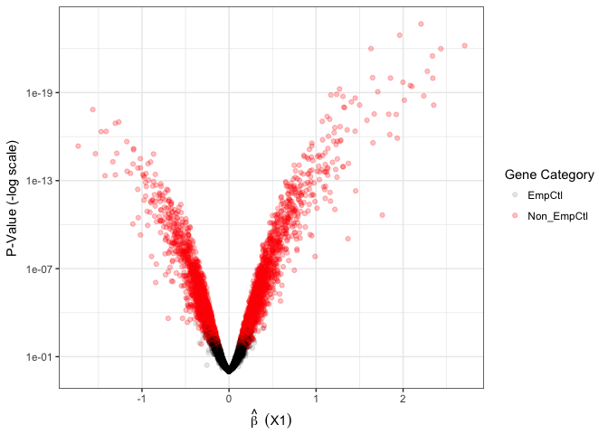

``` r
## Look at ECDF of p-values
ruv_ecdf(fit_ruvin_emp_samplesA.summary) + genecoloring
```

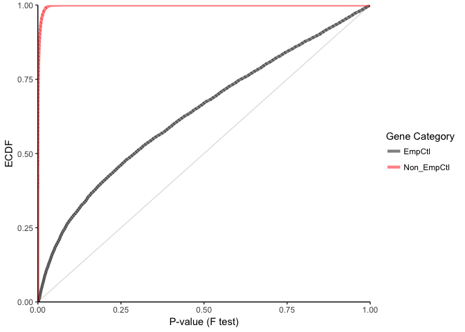

Now we look at the statistics obtained for sample B

``` r
## Look at the distribution of adjusted p-values
ruv_hist(fit_ruvin_emp_samplesB.summary)
```

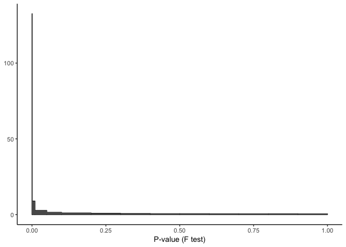

``` r
## Look at the distribution of Volcano plots
genecoloring = list(aes(color=Categ),scale_color_manual(name="Gene Category",values=alpha(c("Black","Red"),c( 0.2, 0.2))))
ruv_volcano(fit_ruvin_emp_samplesB.summary)+genecoloring
```

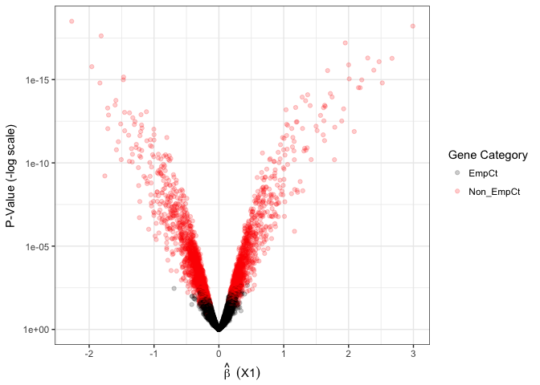

``` r
## Look at ECDF of p-values
ruv_ecdf(fit_ruvin_emp_samplesB.summary) + genecoloring
```

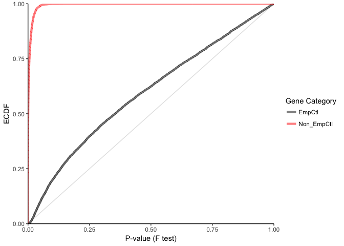

Comparison of RUVinv method with RUV4 method
============================================

We want to assess the effect of our RUVinv method and compare it to the results obtained by RUV4. Did we help ?
\#\# P-values distribution To answer this question, we will run a RUV with k=0 for no adjustment and compare the results to RUVinv and RUV4, namely the pvalues distribution for the unadjusted method for both sample A and sample B, the pvalues distribution for the RUVinv method for both sample A and sample B and finally the pvalues distribution for the RUV4 method for both sample A and sample B.

``` r
### Did we help?
# RUV4 with k = 0 for no adjustment
# Equivalent to a Limma Analysis
fit_sampleA.unadj = RUV4(YA, X=gA, ctl=Emp_Ct_Genes_samplesA$empCt_RUV, 0)
fit_sampleA.summary.unadj = ruv_summary(YA,fit_sampleA.unadj,info_samplesA,Emp_Ct_Genes_samplesA)
fit_sampleB.unadj = RUV4(YB, X=gB, ctl=Emp_Ct_Genes_samplesB$empCt_RUV, 0)
fit_sampleB.summary.unadj = ruv_summary(YB,fit_sampleB.unadj,info_samplesB,Emp_Ct_Genes_samplesB)

## Applying RUV4
#Sample A
# Estimate best k
estimateK<- getK(YA, X=gA, ctl=Emp_Ct_Genes_samplesA$empCt_RUV, Z = 1, eta = NULL, fullW0 = NULL, cutoff = NULL,
                     method="select", l=1, inputcheck = TRUE)  
kA<- estimateK$k
fit_ruv4_emp_sampleA = RUV4(YA, X=gA, ctl=Emp_Ct_Genes_samplesA$empCt_RUV, k=kA,Z = 1, eta = NULL, fullW0 = NULL,
               inputcheck = TRUE)
fit_ruv4_emp_sampleA.summary = ruv_summary(YA,fit_ruv4_emp_sampleA,info_samplesA,Emp_Ct_Genes_samplesA)
#Sample B
# Estimate best k
estimateK<- getK(YB, X=gB, ctl=Emp_Ct_Genes_samplesB$empCt_RUV, Z = 1, eta = NULL, fullW0 = NULL, cutoff = NULL,
                     method="select", l=1, inputcheck = TRUE)  
kB<- estimateK$k
fit_ruv4_emp_sampleB = RUV4(YB, X=gB, ctl=Emp_Ct_Genes_samplesB$empCt_RUV, k=kB,Z = 1, eta = NULL, fullW0 = NULL,
               inputcheck = TRUE)
fit_ruv4_emp_sampleB.summary = ruv_summary(YB,fit_ruv4_emp_sampleB,info_samplesB,Emp_Ct_Genes_samplesB)


# Make a list of plots to compare side-by-side
#plots = list(
ruv_hist(fit_sampleA.summary.unadj)
```

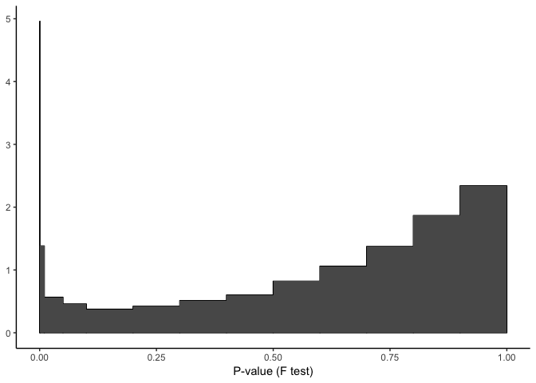

``` r
ruv_hist(fit_sampleB.summary.unadj)
```

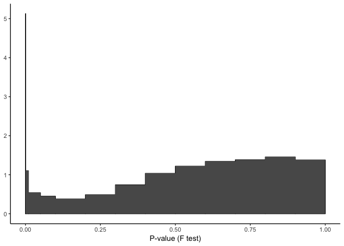

``` r
ruv_hist(fit_ruvin_emp_samplesA.summary)
```


``` r
ruv_hist(fit_ruvin_emp_samplesB.summary)
```


``` r
ruv_hist(fit_ruv4_emp_sampleA.summary)
```

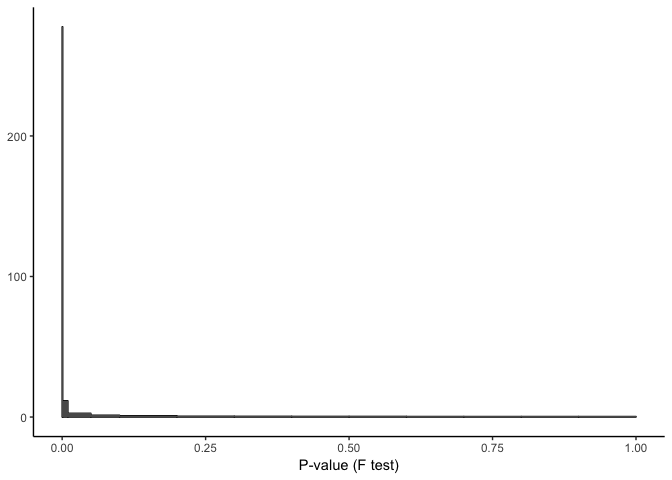

``` r
ruv_hist(fit_ruv4_emp_sampleB.summary)
```

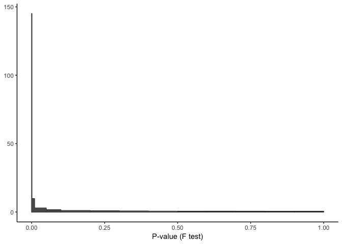

``` r
#)
```

Betahat correlation
-------------------

Another way is to compare how similar are the results obtained by the two datasets sample A and sample B after applying RUVinv and RUV4. To do so we look at the correlation between betahat from sample A and betahat from sample B for the unadjusted method, RUVinv and RUV4

``` r
# unadjusted
plot(fit_sampleA.unadj$betahat,fit_sampleB.unadj$betahat,xlab="Betahat Samples A",ylab="Betahat Samples B",main="Unadjusted",xlim=c(-3,3),cex=0.3,ylim=c(-4,4))
#abline(fit_sampleB.unadj$betahat,fit_sampleA.unadj$betahat)
c1=cor.test(fit_sampleB.unadj$betahat,fit_sampleA.unadj$betahat)
text(-3,3, pos=4, paste("Correlation: ",round(c1$estimate,2),sep=""))
```

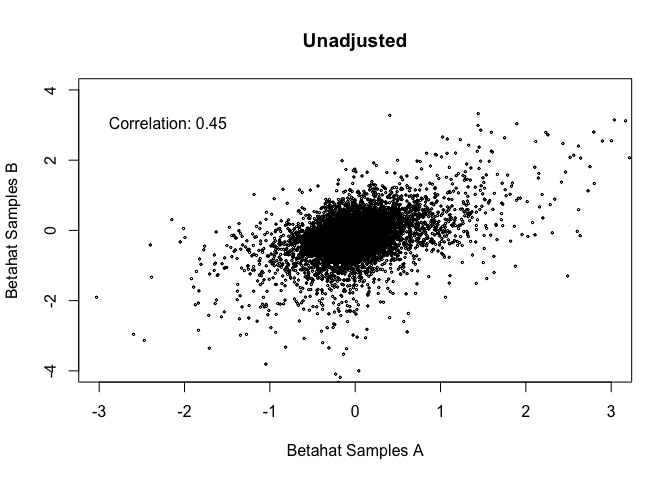

``` r
# RUVinv
plot(fit_ruvin_emp_samplesA$betahat,fit_ruvin_emp_samplesB$betahat,xlab="Betahat Samples A",ylab="Betahat Samples B",main="RUVinv",xlim=c(-3,3),cex=0.3,ylim=c(-4,4))
#abline(fit_ruvin_emp_samplesB$betahat,fit_ruvin_emp_samplesA$betahat)
c1=cor.test(fit_ruvin_emp_samplesA$betahat,fit_ruvin_emp_samplesB$betahat)
text(-3,3, pos=4, paste("Correlation: ",round(c1$estimate,2),sep=""))
```

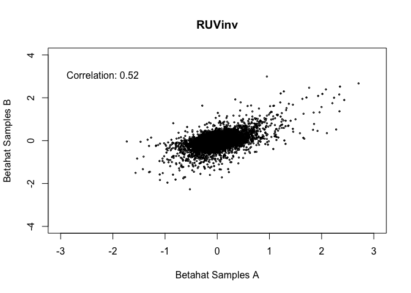

``` r
# RUV4
plot(fit_ruv4_emp_sampleA$betahat,fit_ruv4_emp_sampleB$betahat,xlab="Betahat Samples A",ylab="Betahat Samples B",main="RUV4",xlim=c(-3,3),cex=0.3,ylim=c(-4,4))
#abline(fit_ruv4_emp_sampleB$betahat,fit_ruv4_emp_sampleA$betahat)
c1=cor.test(fit_ruv4_emp_sampleA$betahat,fit_ruv4_emp_sampleB$betahat)
text(-3,3, pos=4, paste("Correlation: ",round(c1$estimate,2),sep=""))
```

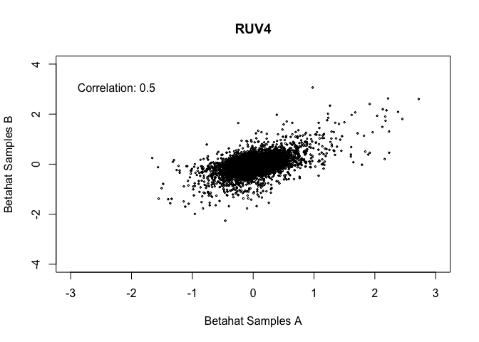

Overlap between differential expressed genes obtained with RUVinv and RUV4
--------------------------------------------------------------------------

Finally we can also look at the differentially expressed genes obtained by each method RUVinv and RUV4 accross the two samples A and B and the overlap between methods using a Venn diagram to check for consistency between methods on the same sample.

``` r
## Obtain DEGs defined as having p-val<0.05 and abs(logFC)=abs(betahats)=1 for sample A:
DEGsRUVinv_sampleA<- row.names(fit_ruvin_emp_samplesA.summary$C)[fit_ruvin_emp_samplesA.summary$C$F.p.BH<0.05&abs(fit_ruvin_emp_samplesA.summary$C$b_X1)>1]  
DEGsRUV4_sampleA <- row.names(fit_ruv4_emp_sampleA.summary$C)[fit_ruv4_emp_sampleA.summary$C$F.p.BH<0.05&abs(fit_ruv4_emp_sampleA.summary$C$b_X1)>1]  
allDEGs_sampleA<- c(DEGsRUVinv_sampleA,DEGsRUV4_sampleA)
## remove duplicated gene symbols:
allDEGs_sampleA<- allDEGs_sampleA[!duplicated(allDEGs_sampleA)]  
## Draw a Venn diagram comparing DEGs for sample A
Counts_sampleA <- matrix(0, nrow= length(allDEGs_sampleA), ncol=2)
row.names(Counts_sampleA)<- allDEGs_sampleA
colnames(Counts_sampleA)<- c("RUVinv_A","Ruv4_A")
for( i in 1:length(allDEGs_sampleA)) {
  Counts_sampleA[i,1]<- allDEGs_sampleA[i] %in% DEGsRUVinv_sampleA
  Counts_sampleA[i,2]<- allDEGs_sampleA[i] %in% DEGsRUV4_sampleA
}
col<- c("blue", "violet")
vennDiagram(vennCounts(Counts_sampleA), circle.col=col, cex=c(1.6, 1.2, 1), lwd=2)
```

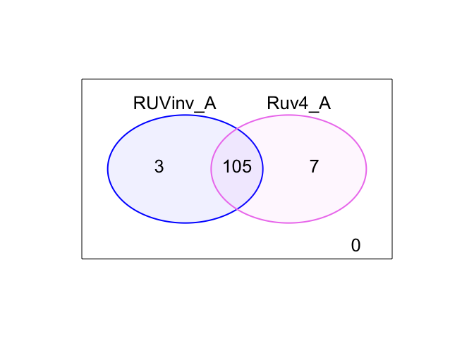

``` r
## Obtain DEGs defined as having p-val<0.05 and abs(logFC)=abs(betahats)=1 for sample B:
DEGsRUVinv_sampleB<- row.names(fit_ruvin_emp_samplesB.summary$C)[fit_ruvin_emp_samplesB.summary$C$F.p.BH<0.05&abs(fit_ruvin_emp_samplesB.summary$C$b_X1)>1]  
DEGsRUV4_sampleB <- row.names(fit_ruv4_emp_sampleB.summary$C)[fit_ruv4_emp_sampleB.summary$C$F.p.BH<0.05&abs(fit_ruv4_emp_sampleB.summary$C$b_X1)>1]  
allDEGs_sampleB<- c(DEGsRUVinv_sampleB,DEGsRUV4_sampleB)
## remove duplicated gene symbols:
allDEGs_sampleB<- allDEGs_sampleB[!duplicated(allDEGs_sampleB)]  
## Draw a Venn diagram comparing DEGs for sample B
Counts_sampleB <- matrix(0, nrow= length(allDEGs_sampleB), ncol=2)
row.names(Counts_sampleB)<- allDEGs_sampleB
colnames(Counts_sampleB)<- c("RUVinv_B","Ruv4_B")
for( i in 1:length(allDEGs_sampleB)) {
  Counts_sampleB[i,1]<- allDEGs_sampleB[i] %in% DEGsRUVinv_sampleB
  Counts_sampleB[i,2]<- allDEGs_sampleB[i] %in% DEGsRUV4_sampleB
}
col<- c("blue", "violet")
vennDiagram(vennCounts(Counts_sampleB), circle.col=col, cex=c(1.6, 1.2, 1), lwd=2)
```

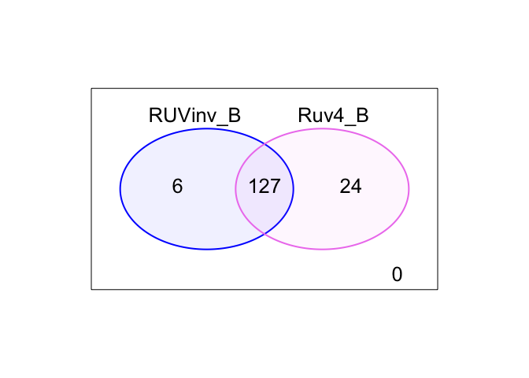

Overlap between differential expressed genes obtained across samples
--------------------------------------------------------------------

We can also look at the differentially expressed genes obtained by each sample A and B for the same method RUVinv and RUV4 and the overlap between samples using a Venn diagram.

``` r
## Obtain DEGs defined as having p-val<0.05 and abs(logFC)=abs(betahats)=1 for RUVinv
allDEGs_RUVinv<- c(DEGsRUVinv_sampleA,DEGsRUVinv_sampleB)
## remove duplicated gene symbols:
allDEGs_RUVinv<- allDEGs_RUVinv[!duplicated(allDEGs_RUVinv)]  
## Draw a Venn diagram comparing DEGs for RUVinv
Counts_RUVinv <- matrix(0, nrow= length(allDEGs_RUVinv), ncol=2)
row.names(Counts_RUVinv)<- allDEGs_RUVinv
colnames(Counts_RUVinv)<- c("RUVinv_A","RUVinv_B")
for( i in 1:length(allDEGs_RUVinv)) {
  Counts_RUVinv[i,1]<- allDEGs_RUVinv[i] %in% DEGsRUVinv_sampleA
  Counts_RUVinv[i,2]<- allDEGs_RUVinv[i] %in% DEGsRUVinv_sampleB
}
col<- c("blue", "violet")
vennDiagram(vennCounts(Counts_RUVinv), circle.col=col, cex=c(1.6, 1.2, 1), lwd=2)
```

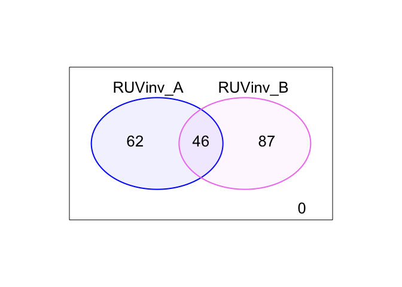

``` r
## Obtain DEGs defined as having p-val<0.05 and abs(logFC)=abs(betahats)=1 for RUV4
allDEGs_RUV4<- c(DEGsRUV4_sampleA,DEGsRUV4_sampleB)
## remove duplicated gene symbols:
allDEGs_RUV4<- allDEGs_RUV4[!duplicated(allDEGs_RUV4)]  
## Draw a Venn diagram comparing DEGs for RUV4
Counts_RUV4 <- matrix(0, nrow= length(allDEGs_RUV4), ncol=2)
row.names(Counts_RUV4)<- allDEGs_RUV4
colnames(Counts_RUV4)<- c("RUV4_A","RUV4_B")
for( i in 1:length(allDEGs_RUV4)) {
  Counts_RUV4[i,1]<- allDEGs_RUV4[i] %in% DEGsRUV4_sampleA
  Counts_RUV4[i,2]<- allDEGs_RUV4[i] %in% DEGsRUV4_sampleB
}
col<- c("blue", "violet")
vennDiagram(vennCounts(Counts_RUV4), circle.col=col, cex=c(1.6, 1.2, 1), lwd=2)
```

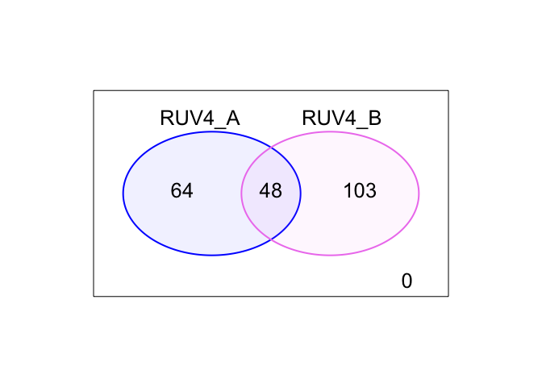
