How to remove unwanted variation from transcriptomics data using RUVinv and RUV4
================
Sepideh Foroutan and Marie Trussart

-   [Data description](#data-description)
-   [Assessment of unwanted variation in the data](#assessment-of-unwanted-variation-in-the-data)
    -   [RLE plot](#rle-plot)
    -   [PCA plot](#pca-plot)
-   [Remove batch effects using RUV methods](#remove-batch-effects-using-ruv-methods)
    -   [RUVinv](#ruvinv)
        -   [Apply RUVinv using house-keeping genes](#apply-ruvinv-using-house-keeping-genes)
    -   [RUV4](#ruv4)
        -   [Apply RUV4 using house-keeping genes](#apply-ruv4-using-house-keeping-genes)
-   [Comparison of results of unadjusted, RUVinv- and RUV4-adjusted data](#comparison-of-results-of-unadjusted-ruvinv--and-ruv4-adjusted-data)
    -   [Unadjusted data](#unadjusted-data)
        -   [Apply DE analysis in the unadjusted data using HK genes](#apply-de-analysis-in-the-unadjusted-data-using-hk-genes)
    -   [P-values distribution](#p-values-distribution)
    -   [Betahat correlation](#betahat-correlation)
    -   [Overlap between differentially expressed genes](#overlap-between-differentially-expressed-genes)
        -   [DEGs in the unadjusted data](#degs-in-the-unadjusted-data)
        -   [DEGs in the RUVinv-adjusted data](#degs-in-the-ruvinv-adjusted-data)
        -   [DEGs in the RUV4-adjusted data for different k](#degs-in-the-ruv4-adjusted-data-for-different-k)
        -   [Compare the unadjusted, RUV4 and RUVinv-adjusted in samples A data](#compare-the-unadjusted-ruv4-and-ruvinv-adjusted-in-samples-a-data)
        -   [Compare the unadjusted, RUV4 and RUVinv-adjusted in samples B data](#compare-the-unadjusted-ruv4-and-ruvinv-adjusted-in-samples-b-data)

Data description
================

In this tutorial, we aim to obtain differentially expressed genes between two biological conditions in an integrated data. This integrated data set is generated by combining 10 microarray studies on control and TGFb-treated samples (for more information, see here <http://mcr.aacrjournals.org/content/15/5/619>). 

First, we assess the presence of unwanted variation in the integrated data which combines differents studies and platforms. Second, we show how to use two RUV methods: RUVinv and RUV4 to remove unwanted variation and detect differentially expressed genes comparing control samples to TGFb-treated samples. Third, we assess whether RUV methods are useful and compare the results obtained by each method.

``` r
library(ruv)            ## for applying RUV methods
library(limma)          ## for vennDiagram()
library(ggplot2)        ## for data visualisation
```

The integrated data introduced above have been split into two data sets: samples A and samples B, each containing different studies, platforms and tissues. We will explore and normalise these two data sets separately in order to compare the results obtained by the two normalisation methods (RUV4 and RUVinv).

Read in the two integrated datasets.

``` r
samplesA<- read.table("expr_10data_sampleA.txt", header = T, sep = "\t")
samplesB<- read.table("expr_10data_sampleB.txt", header = T, sep = "\t")
```

Look at the data in each samples A and B, then make a matrix for each these data where the row names are gene IDs.

``` r
head(samplesA,3)
```

    ##   EntrezID D_Ctrl_R1 D_TGFb_R1 D_Ctrl_R2 D_TGFb_R2 Hes_Ctrl_R1 Hes_TGFb_R1
    ## 1        2  4.182898  4.234204  4.271958  4.221931    6.212082    6.307131
    ## 2        9  5.763352  6.063185  5.698005  5.856127    8.136114    8.511206
    ## 3       10  4.467305  4.427406  4.403148  4.432531    4.746120    4.690118
    ##   Hes_Ctrl_R2 Hes_TGFb_R2 Hil_Ctrl_R1 Hil_Ctrl_R2 Hil_Ctrl_R3 Hil_TGFb_R1
    ## 1    6.127601    6.147889    5.506770    5.553145    5.479789    5.569616
    ## 2    8.454491    8.423706    6.624455    6.918824    6.689678    6.857544
    ## 3    4.655949    4.599947    5.634859    5.713780    5.587489    5.643846
    ##   Hil_TGFb_R2 Hil_TGFb_R3 M_Ctrl_R1 M_Ctrl_R2 M_Ctrl_R3 M_TGFb_R1
    ## 1    5.671409    5.573899  4.560858  4.403457  4.319724  4.744270
    ## 2    6.844987    6.896004  4.416877  4.319870  4.393092  4.544959
    ## 3    5.714321    5.629158  4.093639  4.033749  4.032735  4.023618
    ##   M_TGFb_R2 M_TGFb_R3 K_Ctrl_R1 K_Ctrl_R2 K_Ctrl_R3 K_TGFb_R1 K_TGFb_R2
    ## 1  4.588234  4.584527  4.777384  4.917127  4.858409  4.937631  5.168482
    ## 2  4.458979  4.396294  7.988627  7.962891  8.171779  8.057742  8.042637
    ## 3  4.158607  4.212378  4.998611  5.313192  4.930239  4.887161  4.924362
    ##   K_TGFb_R3 S_A_Ctrl_R1 S_A_Ctrl_R2 S_A_Ctrl_R3 S_A_TGFb_R1 S_A_TGFb_R2
    ## 1  5.194140    3.476009    3.507338    3.286060    3.113494    3.385346
    ## 2  8.080908    7.966643    7.958268    7.978372    8.065126    8.222971
    ## 3  4.828075    4.245783    4.266803    4.038102    4.635477    4.422005
    ##   S_A_TGFb_R3
    ## 1    3.111588
    ## 2    8.054848
    ## 3    4.507648

``` r
head(samplesB,3)
```

    ##   EntrezID S_HCC_Ctrl_R1 S_HCC_Ctrl_R2 S_HCC_Ctrl_R3 S_HCC_TGFb_R1
    ## 1        2      3.378005      3.441901      3.658986      3.562072
    ## 2        9      9.808725      9.850605      9.855069      8.562214
    ## 3       10      4.611709      4.718516      4.835701      4.648048
    ##   S_HCC_TGFb_R2 S_HCC_TGFb_R3 S_NCI_Ctrl_R1 S_NCI_Ctrl_R2 S_NCI_Ctrl_R3
    ## 1      3.592344      3.752616      5.123849      5.170630      5.150285
    ## 2      8.446298      8.326317      8.023910      8.085010      7.879816
    ## 3      4.624559      4.672416      5.647240      5.581731      5.524096
    ##   S_NCI_TGFb_R1 S_NCI_TGFb_R2 S_NCI_TGFb_R3 T_Ctrl1_R1 T_Ctrl1_R2
    ## 1      5.087718      4.802983      4.539320   4.881446   4.957741
    ## 2      7.420857      7.400648      7.369982   8.950682   8.869001
    ## 3      5.564654      5.515069      5.345369   5.057659   5.028980
    ##   T_Ctrl1_R3 T_TGFb_R1 T_TGFb_R2 T_TGFb_R3 T_Ctrl2_R1 T_Ctrl2_R2
    ## 1   4.957741  5.021006  4.957741  4.874664   5.134511   4.957741
    ## 2   8.827853  8.827853  8.834212  8.835467   8.506163   8.616943
    ## 3   5.196755  5.141569  5.059402  5.062695   5.196449   5.233412
    ##   T_Ctrl2_R3 W_Ctrl_R1 W_Ctrl_R2 W_Ctrl_R3 W_TGFb_R1 W_TGFb_R2 W_TGFb_R3
    ## 1   5.099819  3.092686  3.522515  3.116518  2.961264  3.095648  3.077959
    ## 2   8.552184  5.235870  5.431020  5.040574  5.476287  5.511955  5.123399
    ## 3   5.183326  3.087465  3.150153  3.270087  3.178776  3.178776  3.127422

``` r
mA<-samplesA[,2:dim(samplesA)[2]]
mB<-samplesB[,2:dim(samplesB)[2]]
row.names(mA)<- samplesA[,1]
row.names(mB)<- samplesB[,1]
mA<- as.matrix(mA)
mB<- as.matrix(mB)
```

Look at the information related to each sample including the name of the studies, types of platform, treatment, and tissue:

``` r
info_samplesA<- read.table("info_10data_sampleA.txt", sep="\t", header=T)
info_samplesA
```

    ##        samples      study treatment      platform    tissue
    ## 1    D_Ctrl_R1   Deshiere      Ctrl       Agilent    Breast
    ## 2    D_TGFb_R1   Deshiere      TGFb       Agilent    Breast
    ## 3    D_Ctrl_R2   Deshiere      Ctrl       Agilent    Breast
    ## 4    D_TGFb_R2   Deshiere      TGFb       Agilent    Breast
    ## 5  Hes_Ctrl_R1    Hesling      Ctrl HG_U133_Plus2    Breast
    ## 6  Hes_TGFb_R1    Hesling      TGFb HG_U133_Plus2    Breast
    ## 7  Hes_Ctrl_R2    Hesling      Ctrl HG_U133_Plus2    Breast
    ## 8  Hes_TGFb_R2    Hesling      TGFb HG_U133_Plus2    Breast
    ## 9  Hil_Ctrl_R1      Hills      Ctrl      Illumina    Kidney
    ## 10 Hil_Ctrl_R2      Hills      Ctrl      Illumina    Kidney
    ## 11 Hil_Ctrl_R3      Hills      Ctrl      Illumina    Kidney
    ## 12 Hil_TGFb_R1      Hills      TGFb      Illumina    Kidney
    ## 13 Hil_TGFb_R2      Hills      TGFb      Illumina    Kidney
    ## 14 Hil_TGFb_R3      Hills      TGFb      Illumina    Kidney
    ## 15   M_Ctrl_R1     Maupin      Ctrl HG_U133_Plus2 Pancrease
    ## 16   M_Ctrl_R2     Maupin      Ctrl HG_U133_Plus2 Pancrease
    ## 17   M_Ctrl_R3     Maupin      Ctrl HG_U133_Plus2 Pancrease
    ## 18   M_TGFb_R1     Maupin      TGFb HG_U133_Plus2 Pancrease
    ## 19   M_TGFb_R2     Maupin      TGFb HG_U133_Plus2 Pancrease
    ## 20   M_TGFb_R3     Maupin      TGFb HG_U133_Plus2 Pancrease
    ## 21   K_Ctrl_R1 Keshamouni      Ctrl HG_U133_Plus2      Lung
    ## 22   K_Ctrl_R2 Keshamouni      Ctrl HG_U133_Plus2      Lung
    ## 23   K_Ctrl_R3 Keshamouni      Ctrl HG_U133_Plus2      Lung
    ## 24   K_TGFb_R1 Keshamouni      TGFb HG_U133_Plus2      Lung
    ## 25   K_TGFb_R2 Keshamouni      TGFb HG_U133_Plus2      Lung
    ## 26   K_TGFb_R3 Keshamouni      TGFb HG_U133_Plus2      Lung
    ## 27 S_A_Ctrl_R1   Sun_A549      Ctrl HG_U133_Plus2      Lung
    ## 28 S_A_Ctrl_R2   Sun_A549      Ctrl HG_U133_Plus2      Lung
    ## 29 S_A_Ctrl_R3   Sun_A549      Ctrl HG_U133_Plus2      Lung
    ## 30 S_A_TGFb_R1   Sun_A549      TGFb HG_U133_Plus2      Lung
    ## 31 S_A_TGFb_R2   Sun_A549      TGFb HG_U133_Plus2      Lung
    ## 32 S_A_TGFb_R3   Sun_A549      TGFb HG_U133_Plus2      Lung

``` r
info_samplesB<- read.table("info_10data_sampleB.txt", sep="\t", header=T)
info_samplesB
```

    ##          samples   study treatment      platform tissue
    ## 1  S_HCC_Ctrl_R1 Sun_HCC      Ctrl HG_U133_Plus2   Lung
    ## 2  S_HCC_Ctrl_R2 Sun_HCC      Ctrl HG_U133_Plus2   Lung
    ## 3  S_HCC_Ctrl_R3 Sun_HCC      Ctrl HG_U133_Plus2   Lung
    ## 4  S_HCC_TGFb_R1 Sun_HCC      TGFb HG_U133_Plus2   Lung
    ## 5  S_HCC_TGFb_R2 Sun_HCC      TGFb HG_U133_Plus2   Lung
    ## 6  S_HCC_TGFb_R3 Sun_HCC      TGFb HG_U133_Plus2   Lung
    ## 7  S_NCI_Ctrl_R1 Sun_NCI      Ctrl HG_U133_Plus2   Lung
    ## 8  S_NCI_Ctrl_R2 Sun_NCI      Ctrl HG_U133_Plus2   Lung
    ## 9  S_NCI_Ctrl_R3 Sun_NCI      Ctrl HG_U133_Plus2   Lung
    ## 10 S_NCI_TGFb_R1 Sun_NCI      TGFb HG_U133_Plus2   Lung
    ## 11 S_NCI_TGFb_R2 Sun_NCI      TGFb HG_U133_Plus2   Lung
    ## 12 S_NCI_TGFb_R3 Sun_NCI      TGFb HG_U133_Plus2   Lung
    ## 13    T_Ctrl1_R1   Taube      Ctrl   HT_HG_U133A Breast
    ## 14    T_Ctrl1_R2   Taube      Ctrl   HT_HG_U133A Breast
    ## 15    T_Ctrl1_R3   Taube      Ctrl   HT_HG_U133A Breast
    ## 16     T_TGFb_R1   Taube      TGFb   HT_HG_U133A Breast
    ## 17     T_TGFb_R2   Taube      TGFb   HT_HG_U133A Breast
    ## 18     T_TGFb_R3   Taube      TGFb   HT_HG_U133A Breast
    ## 19    T_Ctrl2_R1   Taube      Ctrl   HT_HG_U133A Breast
    ## 20    T_Ctrl2_R2   Taube      Ctrl   HT_HG_U133A Breast
    ## 21    T_Ctrl2_R3   Taube      Ctrl   HT_HG_U133A Breast
    ## 22     W_Ctrl_R1   Walsh      Ctrl    HG_U133A_2 Kidney
    ## 23     W_Ctrl_R2   Walsh      Ctrl    HG_U133A_2 Kidney
    ## 24     W_Ctrl_R3   Walsh      Ctrl    HG_U133A_2 Kidney
    ## 25     W_TGFb_R1   Walsh      TGFb    HG_U133A_2 Kidney
    ## 26     W_TGFb_R2   Walsh      TGFb    HG_U133A_2 Kidney
    ## 27     W_TGFb_R3   Walsh      TGFb    HG_U133A_2 Kidney

Assessment of unwanted variation in the data
============================================

Here we perform some exploratory analysis on the integrated data to assess the presence of unwanted variation in each dataset.

RLE plot
--------

We start by looking at the RLE plots in samples A data, coloured by study, platform and tissue:

``` r
## Transpose the expression matrix so that we have genes in columns and samples in rows
YA <- t(mA)
## Plot RLE coloured by study
ruv_rle(YA, info_samplesA$study, ylim = c(-4,4))
```


``` r
## Plot RLE coloured by platform
ruv_rle(YA, info_samplesA$platform, ylim = c(-4,4))
```

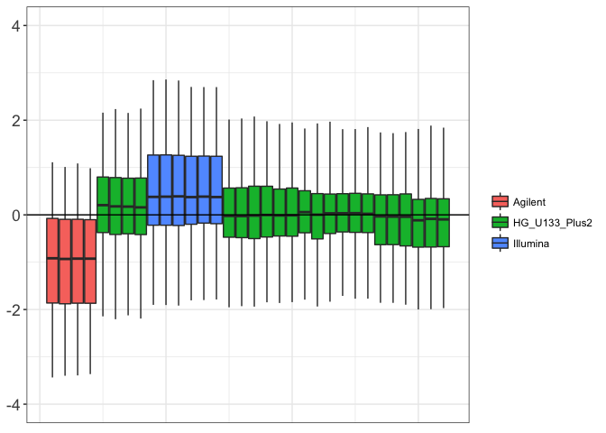

``` r
## Plot RLE coloured by platform
ruv_rle(YA, info_samplesA$tissue, ylim = c(-4,4))
```

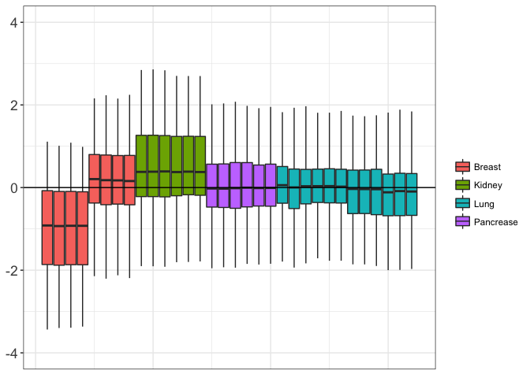

Similarly, we look at the RLE plots in sample B data coloured by study, platform and tissue:

``` r
YB <- t(mB)
## Plot RLE coloured by study
ruv_rle(YB, info_samplesB$study, ylim = c(-4,4))
```

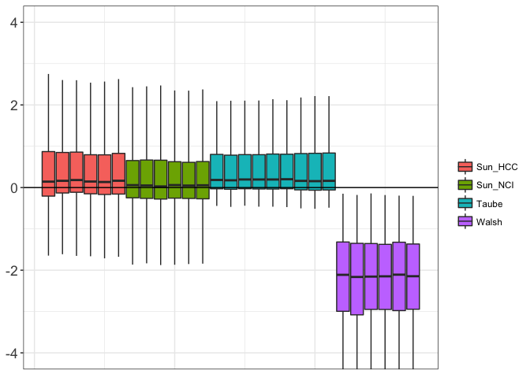

``` r
## Plot RLE coloured by platform
ruv_rle(YB, info_samplesB$platform, ylim = c(-4,4))
```

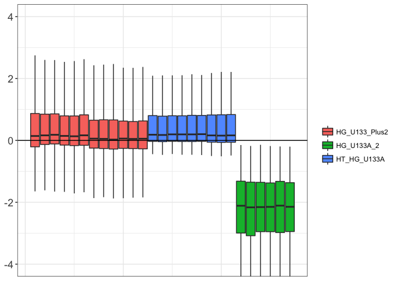

``` r
## Plot RLE coloured by tissue
ruv_rle(YB, info_samplesB$tissue, ylim = c(-4,4))
```

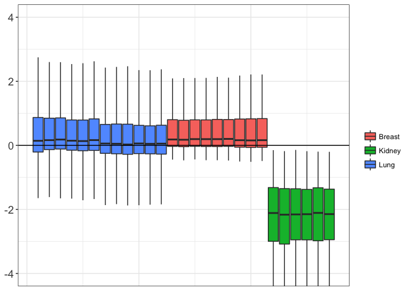

PCA plot
--------

In transcriptomics applications, one of the most utilized exploratory plots is the multi-dimensional scaling (MDS) plot or a principal component analysis (PCA) plot. To assess the presence of unwanted variation in each sample, we use PCA plots to show similarities between samples measured in an unsupervised way. Ideally, samples should cluster together according to the treatment (i.e. the biological factor of interest). Here, we see that samples are rather clustered by studies (i.e. unwanted variation) in both samples A and B data.
In the current example, it's important to note that in some cases, different studies are confounded with different platforms and tissues, and therefore there is no way to identify how much of the unwanted variation come from each of these factors. Such situations must be avoided when designing an experiment and for the purpose of this tutorial, we only consider "study" as the source of unwanted variation.

``` r
gg_additions <- list(aes(color = info_samplesA$study, 
                         shape = info_samplesA$treatment, 
                         size = 5, alpha = .7),
                     labs(color = "Study", shape="Treatment"),
                     scale_size_identity(guide = "none"),
                     scale_alpha(guide = "none"),
                     theme(legend.text = element_text(size = 12),
                           legend.title = element_text(size = 16)),
                     guides(color = guide_legend(override.aes = list(size = 4)),
                            shape = guide_legend(override.aes = list(size = 4))))
options(repr.plot.width = 8, repr.plot.height = 6)
ruv_svdplot(YA) + gg_additions 
```


``` r
gg_additions <- list(aes(color = info_samplesB$study,
                         shape = info_samplesB$treatment,
                         size = 5, alpha = .7),
                     labs(color = "Study",shape = "Treatment"),
                     scale_size_identity(guide = "none"),
                     scale_alpha(guide = "none"),
                     theme(legend.text = element_text(size = 12),
                           legend.title = element_text(size = 16)),
                     guides(color = guide_legend(override.aes = list(size = 4)),
                            shape = guide_legend(override.aes = list(size = 4))))
options(repr.plot.width=8, repr.plot.height=6)
ruv_svdplot(YB) + gg_additions #
```

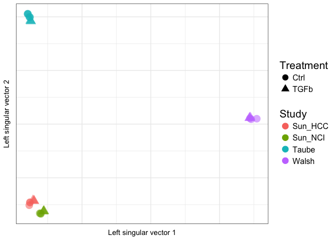

Remove batch effects using RUV methods
======================================

There are several RUV methods for removing unwanted variation in order to obtain DEGs; these include RUV-2, RUV-4, RUV-inv and RUV-rinv. In general, RUV methods are dependent on negative control genes (genes which are not associated with the biological factor of interest) and replicate samples (if applicable). RUV-2 removes unwanted variation in two steps. RUV-4 came after RUV-2 and has four steps. For RUV-4 we can estimate the dimension of unwanted variation (k) or select different values for k, while for RUV-inv and RUV-rinv we don't need to estimate k as it is set to be the maximum value. In general, RUV-inv and RUV-rinv are better than RUV-4. RUV-inv is recommended when we have large number of control genes (~1000), while RUV-rinv is more appropriate with small number of control genes (~60).
Selection of negative control genes is very important. Examples of negative control genes are the spike-in controls or the housekeeping (HK) genes. It is also possible to define empirical negative control genes using an iterative approach. However, it is only recomended if (i) the initial negative control genes are not very good or there are only a few of them; (ii) the beta seems to be very sparse. Therefore, the user needs to generate diagnostic plots to assess the performance of the initial analysis, and only if needed, use an iterative approach to define better control genes.

RUVinv
------

Here, we first focus on RUV-inv, which is performed by **RUVinv()** function. This function take expression matrix (Y), biological factor of interest (X), and a vector for indices of negative control genes (ctl).

### Apply RUVinv using house-keeping genes

We begin with the list of housekeeping (HK) genes as our negative controls.

``` r
HKgenes <- read.table("HouseKeeping_genes_IDs.txt", header=T, sep="\t")
hk <- HKgenes$GeneID
ctrl <- colnames(YA) %in% hk
```

We run RUVinv using HK genes on samples A data.

``` r
## Take treatment as the biological factor of interest
groups_A <- factor(info_samplesA$treatment) 
gA <- cbind(as.numeric(groups_A))   ## 1 control, 2: TGFb


## Apply RUV-inv using the housekeeping genes as negative controls 
fit_ruvin_hk_samplesA <- RUVinv(YA, gA, ctrl)
fit_ruvin_hk_samplesA.summary <- ruv_summary(YA, 
                                             fit_ruvin_hk_samplesA, 
                                             info_samplesA)
head(fit_ruvin_hk_samplesA.summary$C)
```

    ##                F.p       F.p.BH         p_X1      p.BH_X1     b_X1
    ## 56937 1.469636e-18 1.748867e-14 1.469636e-18 1.748867e-14 2.168560
    ## 1277  6.229333e-18 2.541639e-14 6.229333e-18 2.541639e-14 2.431418
    ## 7045  6.407493e-18 2.541639e-14 6.407493e-18 2.541639e-14 1.625740
    ## 81029 1.649278e-17 4.906602e-14 1.649278e-17 4.906602e-14 2.005119
    ## 5654  2.934959e-17 6.985201e-14 2.934959e-17 6.985201e-14 1.831225
    ## 7052  5.644064e-17 1.119406e-13 5.644064e-17 1.119406e-13 2.262390
    ##            sigma2    var.b_X1 fit.ctl      mean
    ## 56937 0.009645147 0.004443795   FALSE 10.193047
    ## 1277  0.014084849 0.006489293   FALSE  8.060318
    ## 7045  0.006315495 0.002909729   FALSE 13.253531
    ## 81029 0.010599568 0.004883525   FALSE  6.893005
    ## 5654  0.009387898 0.004325273   FALSE  9.709266
    ## 7052  0.015340890 0.007067987   FALSE  9.617799

Check if HK genes as negative control genes in the initial analysis were useful.

``` r
## Look at the distribution of p-values
ruv_hist(fit_ruvin_hk_samplesA.summary)
```

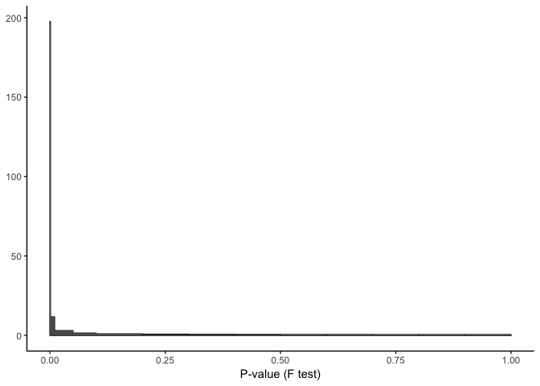

``` r
## Look at the volcano plot
genecoloring <- list(aes(color = fit.ctl),
                     scale_color_manual(name = "Gene Category",
                                        values = alpha(c("Red", "black"),
                                                     c( 0.1, 0.25))))
ruv_volcano(fit_ruvin_hk_samplesA.summary) + genecoloring
```

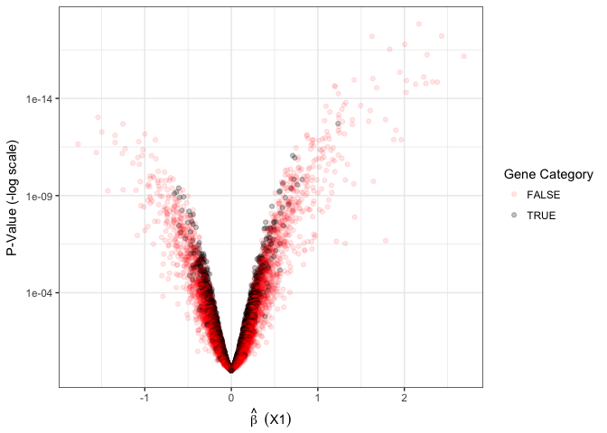

``` r
## Look at ECDF of p-values
ruv_ecdf(fit_ruvin_hk_samplesA.summary) + genecoloring
```

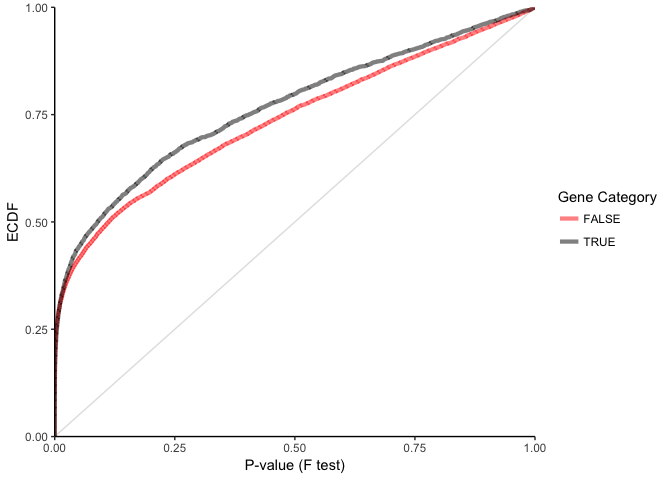

Similarly, we run RUVinv using HK genes on samples B data.

``` r
## Take treatment as the biological factor of interest
groups_B <- factor(info_samplesB$treatment) 
gB <- cbind(as.numeric(groups_B))   ## 1 control, 2: TGFb

## Apply RUV-inv using the housekeeping genes as negative controls 
fit_ruvin_hk_samplesB <- RUVinv(YB, gB, ctrl)
fit_ruvin_hk_samplesB.summary <- ruv_summary(YB, 
                                             fit_ruvin_hk_samplesB, 
                                             info_samplesB)

head(fit_ruvin_hk_samplesB.summary$C)
```

    ##                F.p       F.p.BH         p_X1      p.BH_X1      b_X1
    ## 928   4.912988e-15 2.189772e-11 4.912988e-15 2.189772e-11 -2.337203
    ## 54502 5.601676e-15 2.189772e-11 5.601676e-15 2.189772e-11 -1.843358
    ## 26585 6.044283e-15 2.189772e-11 6.044283e-15 2.189772e-11  2.929713
    ## 7045  7.360577e-15 2.189772e-11 7.360577e-15 2.189772e-11  1.922368
    ## 2200  4.927187e-14 1.172670e-10 4.927187e-14 1.172670e-10  2.344241
    ## 2335  9.071491e-14 1.799179e-10 9.071491e-14 1.799179e-10  2.430787
    ##            sigma2    var.b_X1 fit.ctl      mean
    ## 928   0.007476079 0.004469277   FALSE 10.706924
    ## 54502 0.004739363 0.002833240   FALSE  7.778343
    ## 26585 0.012103644 0.007235683   FALSE  5.516305
    ## 7045  0.005361531 0.003205179   FALSE 12.585668
    ## 2200  0.010495653 0.006274409   FALSE  6.965332
    ## 2335  0.012328905 0.007370346   FALSE  9.735779

Check if HK genes as negative control genes in the initial analysis were useful.

``` r
## Look at the distribution of p-values
ruv_hist(fit_ruvin_hk_samplesB.summary)
```

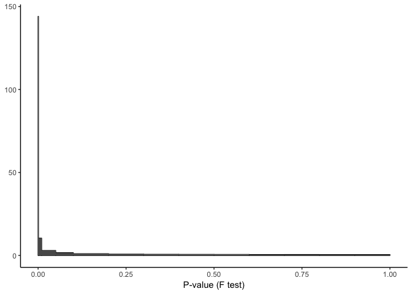

``` r
## Look at the volcano plot
genecoloring <- list(aes(color = fit.ctl),
                     scale_color_manual(name = "Gene Category",
                                        values = alpha(c("Red", "black"),
                                                     c( 0.1, 0.25))))
ruv_volcano(fit_ruvin_hk_samplesB.summary) + genecoloring
```

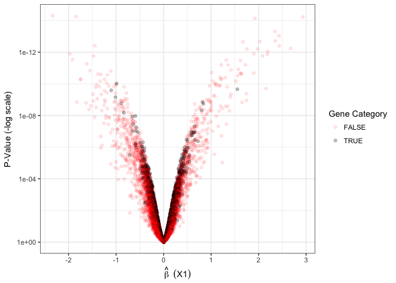

``` r
## Look at ECDF of p-values
ruv_ecdf(fit_ruvin_hk_samplesB.summary) + genecoloring
```

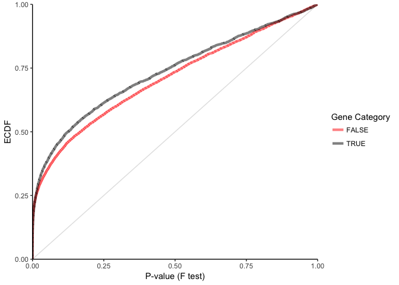

RUV4
----

RUV4 can be run with different values of k in an attempt to find the optimal value. Note that although there is a function to estimate k, called **getK()**, this may not give the optimal value for k and is often recomended to be used when there is no other choice but to automate finding K (e.g. in simulations).

### Apply RUV4 using house-keeping genes

``` r
## Instead of estimating k (commented below), we look at different values for k.
# estimateK<- getK(YA, X = gA,
#                  ctl = ctrl,
#                  Z = 1, eta = NULL, fullW0 = NULL, cutoff = NULL,
#                  method="select", l=1, inputcheck = TRUE)
# kA <- estimateK$k   ## it will be k = 7
# 
# estimateK<- getK(YB, X = gB,
#                  ctl = ctrl,
#                  Z = 1, eta = NULL, fullW0 = NULL, cutoff = NULL,
#                  method="select", l=1, inputcheck = TRUE)
# kB <- estimateK$k   ## it will be k = 6

ks <- c(1, 2, 5, 6, 7, 8, 10, 11, 12, 15, 18, 20, 22, 23, 24)
## For k > 24 I got Error:
# NaNs producedNaNs producedError in sigmashrink(fit$sigma2, fit$df) : 
#   NA/NaN/Inf in foreign function call (arg 1)

beta_corAB_HK <- vector()
fit_ruv4_hk_sampleA_all_k=list()
fit_ruv4_hk_sampleA_all_k.summary=list()
fit_ruv4_hk_sampleB_all_k=list()
fit_ruv4_hk_sampleB_all_k.summary=list()
for (K in ks){
  fit_ruv4_hk_sampleA_all_k[[K]] <- RUV4(YA, X = gA, 
                            ctl = ctrl, 
                            k = K,Z = 1, eta = NULL, 
                            fullW0 = NULL, inputcheck = TRUE)
  
  fit_ruv4_hk_sampleA_all_k.summary[[K]] <- ruv_summary(YA,
                                           fit_ruv4_hk_sampleA_all_k[[K]],
                                           info_samplesA)
  
  fit_ruv4_hk_sampleB_all_k[[K]] <- RUV4(YB, X = gB, 
                            ctl = ctrl, 
                            k = K,Z = 1, eta = NULL, 
                            fullW0 = NULL, inputcheck = TRUE)
  
  fit_ruv4_hk_sampleB_all_k.summary[[K]] <- ruv_summary(YB,
                                           fit_ruv4_hk_sampleB_all_k[[K]],
                                           info_samplesB)
  
  currentCor <- cor.test(fit_ruv4_hk_sampleA_all_k[[K]]$betahat,
                        fit_ruv4_hk_sampleB_all_k[[K]]$betahat)$estimate
  
  beta_corAB_HK <- c(beta_corAB_HK, currentCor)
  
}
names(beta_corAB_HK) <- ks
beta_corAB_HK ## K = 23 seems a good choice
```

    ##         1         2         5         6         7         8        10 
    ## 0.4492948 0.5069814 0.4245761 0.4647153 0.4746189 0.4989672 0.5156815 
    ##        11        12        15        18        20        22        23 
    ## 0.4976659 0.5110828 0.5188996 0.5187489 0.5175255 0.5195172 0.5202835 
    ##        24 
    ## 0.5185545

As k = 23 results in the highest correlation between samples A and B data sets, we consider that as the optimal value, and we run RUV4 using k = 23.

``` r
K = 23

##------- If using HK genes:
fit_ruv4_hk_sampleA <- RUV4(YA, X = gA, 
                          ctl = ctrl, 
                          k = K,Z = 1, eta = NULL, 
                          fullW0 = NULL, inputcheck = TRUE)

fit_ruv4_hk_sampleA.summary <- ruv_summary(YA,
                                         fit_ruv4_hk_sampleA,
                                         info_samplesA)

fit_ruv4_hk_sampleB <- RUV4(YB, X = gB, 
                          ctl = ctrl, 
                          k = K,Z = 1, eta = NULL, 
                          fullW0 = NULL, inputcheck = TRUE)

fit_ruv4_hk_sampleB.summary <- ruv_summary(YB,
                                         fit_ruv4_hk_sampleB,
                                         info_samplesB)
```

Comparison of results of unadjusted, RUVinv- and RUV4-adjusted data
===================================================================

In order to see if we have helped or not, we run differential expression analysis on the **unadjusted data**. Then we compare the results of RUVinv, RUV4 and unadjusted together.

Unadjusted data
---------------

We can run RUV4 with k = 0 to do no adjustment when obtaining DEGs.

### Apply DE analysis in the unadjusted data using HK genes

``` r
# RUV4 with k = 0 for no adjustment
# Equivalent to a Limma Analysis without considering the batch term

##----- In sample A data
fit_unadj_hk_sampleA <- RUV4(YA, X = gA, 
                          ctl = ctrl, 
                          k = 0)
fit_unadj_hk_sampleA.summary <- ruv_summary(YA, 
                                        fit_unadj_hk_sampleA,
                                        info_samplesA)

##----- In sample B data
fit_unadj_hk_sampleB <- RUV4(YB, X = gB, 
                          ctl = ctrl,
                          k = 0)
fit_unadj_hk_sampleB.summary <- ruv_summary(YB, 
                                         fit_unadj_hk_sampleB,
                                         info_samplesB)
```

P-values distribution
---------------------

We compare the results obtained from unajusted, RUVinv- and RUV4- adjusted data using p-value distributions, correlations of beta values and venn diagrams in samples A and B data.

``` r
ruv_hist(fit_unadj_hk_sampleA.summary) + ggtitle("Unadj_A")
```

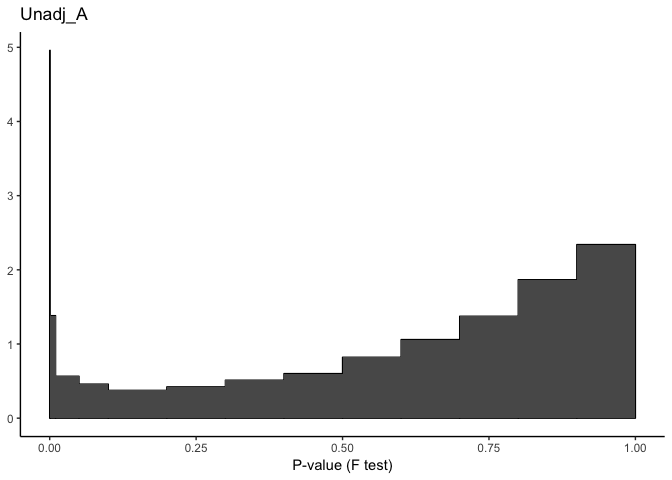

``` r
ruv_hist(fit_unadj_hk_sampleB.summary) + ggtitle("Unadj_B")
```


``` r
ruv_hist(fit_ruvin_hk_samplesA.summary) + ggtitle("RUVinv_HK_A")
```

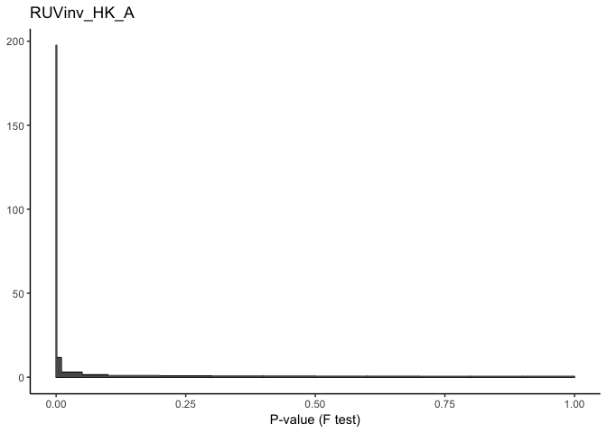

``` r
ruv_hist(fit_ruvin_hk_samplesB.summary) + ggtitle("RUVinv_HK_B")
```

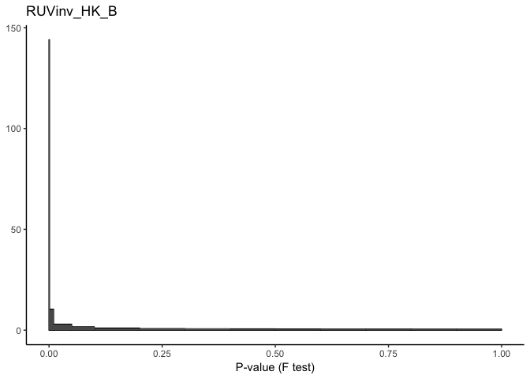

``` r
ruv_hist(fit_ruv4_hk_sampleA.summary) + ggtitle("RUV4_HK_A")
```

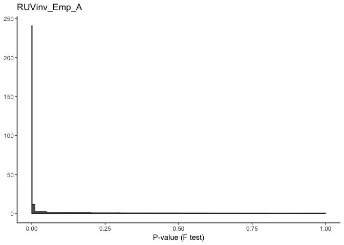

``` r
ruv_hist(fit_ruv4_hk_sampleB.summary) + ggtitle("RUV4_HK_B")
```


Betahat correlation
-------------------

For each of the unadjusted, RUVinv- and RUV4- adjusted settings, we can compare the results between samples A and B data sets to see which method gives more consistent resulst in these two data sets. To quantify these consistencies, we look at the correlations between betahat from sample A and betahat from sample B for the unadjusted method, RUVinv and RUV4.

``` r
##------ Unadjusted data sets
plot(fit_unadj_hk_sampleA$betahat, 
     fit_unadj_hk_sampleB$betahat,
     xlab = "Betahat Samples A",
     ylab = "Betahat Samples B",
     main = "Unadjusted",
     xlim = c(-3,3), cex = 0.3, ylim = c(-4,4))
corVal <- cor.test(fit_unadj_hk_sampleA$betahat, fit_unadj_hk_sampleB$betahat)$estimate
text(-3,3, pos = 4, paste("Correlation: ", round(corVal,2), sep = ""))
```


``` r
##------ RUVinv adjusted data sets
plot(fit_ruvin_hk_samplesA$betahat,
     fit_ruvin_hk_samplesB$betahat,
     xlab = "Betahat Samples A",
     ylab = "Betahat Samples B",
     main = "RUVinv",
     xlim = c(-3,3), cex=0.3, ylim=c(-4,4))
corVal <- cor.test(fit_ruvin_hk_samplesA$betahat, fit_ruvin_hk_samplesB$betahat)$estimate
text(-3,3, pos = 4, paste("Correlation: ", round(corVal,2), sep = ""))
```

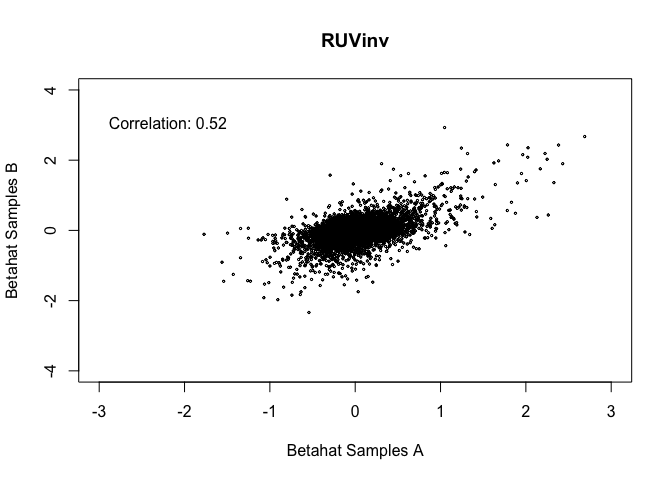

``` r
#------- RUV4 adjusted data sets
plot(fit_ruv4_hk_sampleA$betahat,
     fit_ruv4_hk_sampleB$betahat,
     xlab = "Betahat Samples A",
     ylab = "Betahat Samples B",
     main = "RUV4",
     xlim = c(-3,3), cex = 0.3, ylim = c(-4,4))
#abline(fit_ruv4_emp_sampleB$betahat,fit_ruv4_emp_sampleA$betahat)
corVal <- cor.test(fit_ruv4_hk_sampleA$betahat, fit_ruv4_hk_sampleB$betahat)$estimate
text(-3,3, pos=4, paste("Correlation: ", round(corVal,2),sep=""))
```


Overlap between differentially expressed genes
----------------------------------------------

Finally, for each of the unadjusted, RUVinv and RUV4, we look at the number of overlapping differentially expressed genes (DEGs) between the two samples A and B data sets. We also check for consistency between methods on the same data (sample A or sample B data set).
First, we define DEGs as genes with adjusted p-value &lt; 0.05 and |logFC| &gt; 1 in samples A and B data sets which are unadjusted, RUV4- or RUVinv-adjusted.

``` r
##------ In sample A data
DEGsUnadj_sampleA <- row.names(fit_unadj_hk_sampleA.summary$C)[fit_unadj_hk_sampleA.summary$C$F.p.BH < 0.05 & abs(fit_unadj_hk_sampleA.summary$C$b_X1) > 1]

DEGsRUVinv_sampleA <- row.names(fit_ruvin_hk_samplesA.summary$C)[fit_ruvin_hk_samplesA.summary$C$F.p.BH < 0.05 & abs(fit_ruvin_hk_samplesA.summary$C$b_X1) > 1]

DEGsRUV4_sampleA <- row.names(fit_ruv4_hk_sampleA.summary$C)[fit_ruv4_hk_sampleA.summary$C$F.p.BH < 0.05 & abs(fit_ruv4_hk_sampleA.summary$C$b_X1) > 1]  

DEGsRUV4_sampleA_all_k=list()
for (K in ks){
  DEGsRUV4_sampleA_all_k[[K]]<- row.names(fit_ruv4_hk_sampleA_all_k.summary[[K]]$C)[fit_ruv4_hk_sampleA_all_k.summary[[K]]$C$F.p.BH < 0.05 & abs(fit_ruv4_hk_sampleA_all_k.summary[[K]]$C$b_X1) > 1]  
}

##------ In sample B data:
DEGsUnadj_sampleB <- row.names(fit_unadj_hk_sampleB.summary$C)[fit_unadj_hk_sampleB.summary$C$F.p.BH < 0.05 & abs(fit_unadj_hk_sampleB.summary$C$b_X1) > 1]

DEGsRUVinv_sampleB<- row.names(fit_ruvin_hk_samplesB.summary$C)[fit_ruvin_hk_samplesB.summary$C$F.p.BH < 0.05 & abs(fit_ruvin_hk_samplesB.summary$C$b_X1) > 1] 

DEGsRUV4_sampleB <- row.names(fit_ruv4_hk_sampleB.summary$C)[fit_ruv4_hk_sampleB.summary$C$F.p.BH < 0.05 & abs(fit_ruv4_hk_sampleB.summary$C$b_X1) > 1]  

DEGsRUV4_sampleB_all_k=list()
for (K in ks){
  DEGsRUV4_sampleB_all_k[[K]]<- row.names(fit_ruv4_hk_sampleB_all_k.summary[[K]]$C)[fit_ruv4_hk_sampleB_all_k.summary[[K]]$C$F.p.BH < 0.05 & abs(fit_ruv4_hk_sampleB_all_k.summary[[K]]$C$b_X1) > 1]  
}
```

### DEGs in the unadjusted data

Venn diagram comparing the unadjusted samples A and B data.

``` r
allDEGs_unadj <- c(DEGsUnadj_sampleA, 
                    DEGsUnadj_sampleB)

## remove duplicated gene symbols:
allDEGs_unadj <- allDEGs_unadj[!duplicated(allDEGs_unadj)]  

## Draw a Venn diagram comparing DEGs for RUVinv
Counts_unadj <- matrix(0, nrow = length(allDEGs_unadj), ncol = 2)
row.names(Counts_unadj)<- allDEGs_unadj
colnames(Counts_unadj)<- c("Unadj_A","Unadj_B")

for( i in 1:length(allDEGs_unadj)) {
  Counts_unadj[i,1]<- allDEGs_unadj[i] %in% DEGsUnadj_sampleA
  Counts_unadj[i,2]<- allDEGs_unadj[i] %in% DEGsUnadj_sampleB
}

col <- c("blue", "violet")
vennDiagram(vennCounts(Counts_unadj), 
            circle.col = col, 
            cex = c(1.6, 1.2, 1), lwd=2)
```

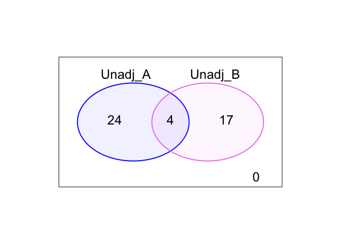

### DEGs in the RUVinv-adjusted data

Venn diagram comparing the RUVinv-adjusted samples A and B data.

``` r
allDEGs_RUVinv <- c(DEGsRUVinv_sampleA, 
                    DEGsRUVinv_sampleB)

## remove duplicated gene symbols:
allDEGs_RUVinv <- allDEGs_RUVinv[!duplicated(allDEGs_RUVinv)]  

## Draw a Venn diagram comparing DEGs for RUVinv
Counts_RUVinv <- matrix(0, nrow = length(allDEGs_RUVinv), ncol = 2)
row.names(Counts_RUVinv)<- allDEGs_RUVinv
colnames(Counts_RUVinv)<- c("RUVinv_A","RUVinv_B")

for( i in 1:length(allDEGs_RUVinv)) {
  Counts_RUVinv[i,1]<- allDEGs_RUVinv[i] %in% DEGsRUVinv_sampleA
  Counts_RUVinv[i,2]<- allDEGs_RUVinv[i] %in% DEGsRUVinv_sampleB
}

col<- c("blue", "violet")
vennDiagram(vennCounts(Counts_RUVinv), 
            circle.col = col,
            cex = c(1.6, 1.2, 1), lwd = 2)
```

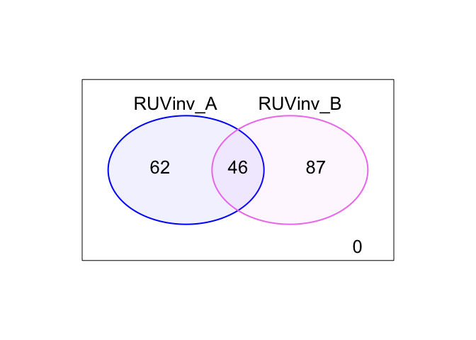

### DEGs in the RUV4-adjusted data for different k

Venn diagram comparing the RUV4-adjusted samples A and B data.

``` r
# 
# allDEGs_RUV4<- c(DEGsRUV4_sampleA, DEGsRUV4_sampleB)
# ## remove duplicated gene symbols:
# allDEGs_RUV4<- allDEGs_RUV4[!duplicated(allDEGs_RUV4)]  
# ## Draw a Venn diagram comparing DEGs for RUV4
# Counts_RUV4 <- matrix(0, nrow= length(allDEGs_RUV4), ncol=2)
# row.names(Counts_RUV4)<- allDEGs_RUV4
# colnames(Counts_RUV4)<- c("RUV4_A","RUV4_B")
# 
# for( i in 1:length(allDEGs_RUV4)) {
#   Counts_RUV4[i,1]<- allDEGs_RUV4[i] %in% DEGsRUV4_sampleA
#   Counts_RUV4[i,2]<- allDEGs_RUV4[i] %in% DEGsRUV4_sampleB
# }
# 
# col<- c("blue", "violet")
# vennDiagram(vennCounts(Counts_RUV4), 
#             circle.col = col, 
#             cex = c(1.6, 1.2, 1), lwd = 2)

allDEGs_RUV4_all_k=list()
for (K in ks){
  allDEGs_RUV4_all_k[[K]]=c(DEGsRUV4_sampleA_all_k[[K]],DEGsRUV4_sampleB_all_k[[K]])
  ## remove duplicated gene symbols:
  allDEGs_RUV4_all_k[[K]]<- allDEGs_RUV4_all_k[[K]][!duplicated(allDEGs_RUV4_all_k[[K]])]  
  ## Draw a Venn diagram comparing DEGs for RUV4
  Counts_RUV4<- matrix(0, nrow= length(allDEGs_RUV4_all_k[[K]]), ncol=2)
  row.names(Counts_RUV4)<- allDEGs_RUV4_all_k[[K]]
  colnames(Counts_RUV4)<- c(paste("RUV4_A_K_",K,sep=""),paste("RUV4_B_K_",K,sep=""))

  for( i in 1:length(allDEGs_RUV4_all_k[[K]])) {
    Counts_RUV4[i,1]<- allDEGs_RUV4_all_k[[K]][i] %in% DEGsRUV4_sampleA_all_k[[K]]
    Counts_RUV4[i,2]<- allDEGs_RUV4_all_k[[K]][i] %in% DEGsRUV4_sampleB_all_k[[K]]
  }

  col<- c("blue", "violet")
  vennDiagram(vennCounts(Counts_RUV4), 
            circle.col = col, 
            cex = c(1.6, 1.2, 1), lwd = 2)
}
```

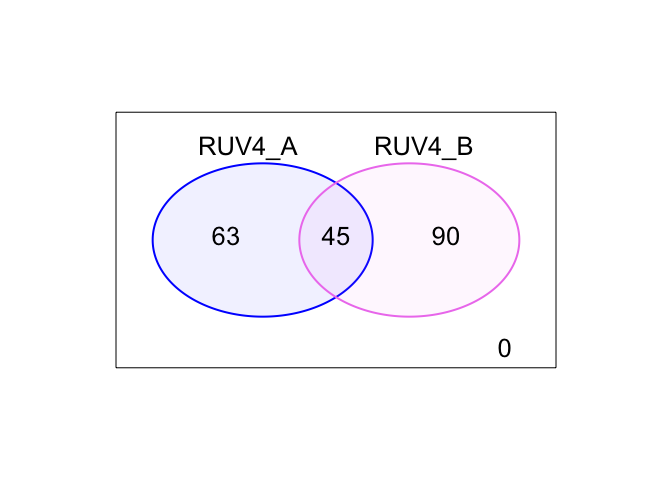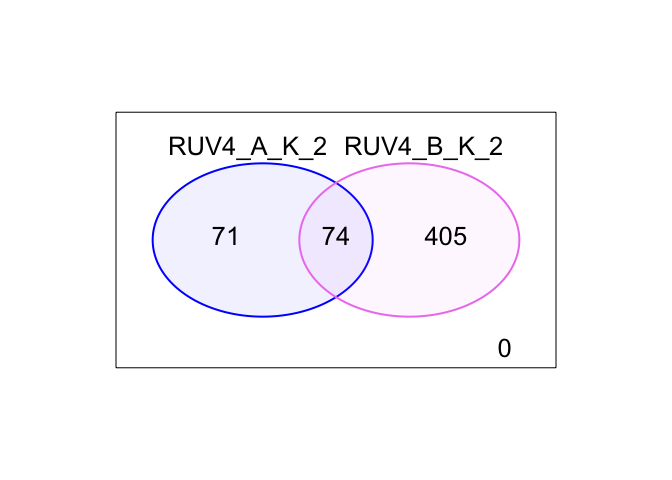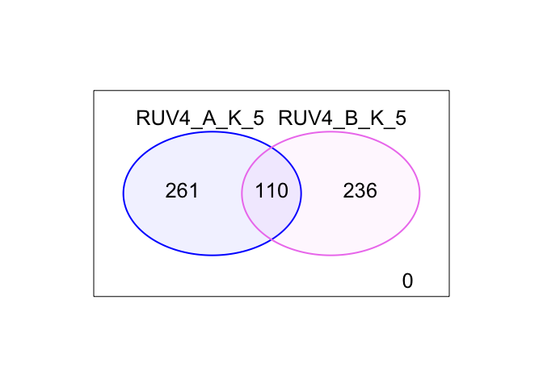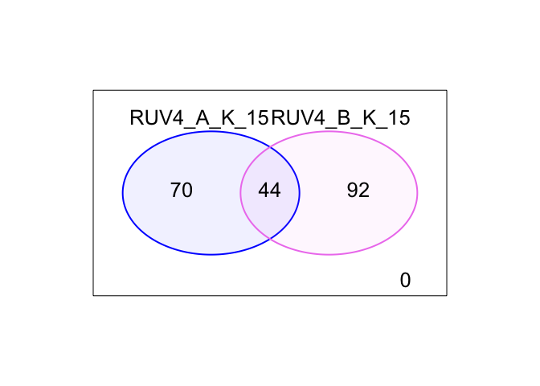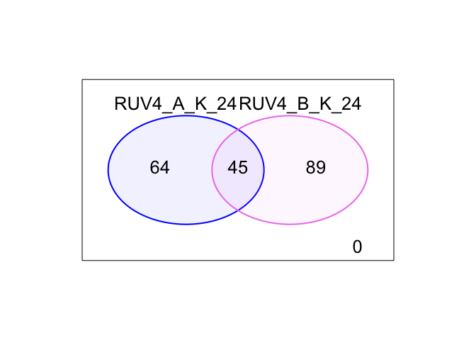

### Compare the unadjusted, RUV4 and RUVinv-adjusted in samples A data

``` r
allDEGs_sampleA <- c(DEGsUnadj_sampleA, DEGsRUVinv_sampleA, DEGsRUV4_sampleA)

## remove duplicated gene symbols:
allDEGs_sampleA <- allDEGs_sampleA[!duplicated(allDEGs_sampleA)]  

## Draw a Venn diagram comparing DEGs for sample A
Counts_sampleA <- matrix(0, nrow= length(allDEGs_sampleA), ncol=3)
row.names(Counts_sampleA)<- allDEGs_sampleA
colnames(Counts_sampleA)<- c("Unadj_A", "RUVinv_A", "Ruv4_A")

for( i in 1:length(allDEGs_sampleA)) {
  Counts_sampleA[i,1]<- allDEGs_sampleA[i] %in% DEGsUnadj_sampleA
  Counts_sampleA[i,2]<- allDEGs_sampleA[i] %in% DEGsRUVinv_sampleA
  Counts_sampleA[i,3]<- allDEGs_sampleA[i] %in% DEGsRUV4_sampleA
}

col<- c("blue", "violet", "darkgreen")
vennDiagram(vennCounts(Counts_sampleA), 
            circle.col=col, 
            cex=c(1.6, 1.2, 1), lwd=2)
```

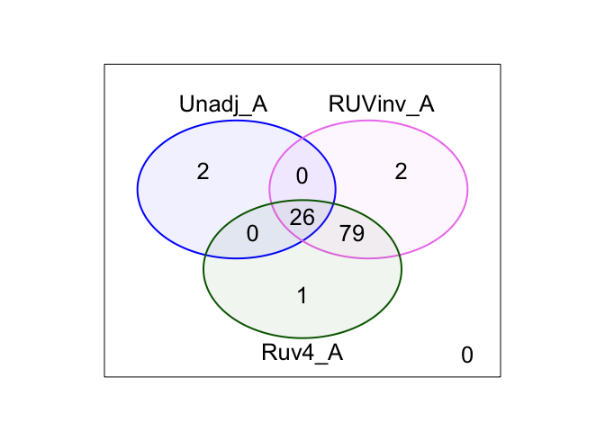

### Compare the unadjusted, RUV4 and RUVinv-adjusted in samples B data

``` r
allDEGs_sampleB <- c(DEGsUnadj_sampleB,
                     DEGsRUVinv_sampleB,
                     DEGsRUV4_sampleB)

## remove duplicated gene symbols:
allDEGs_sampleB <- allDEGs_sampleB[!duplicated(allDEGs_sampleB)] 

## Draw a Venn diagram comparing DEGs for sample B
Counts_sampleB <- matrix(0, nrow = length(allDEGs_sampleB), ncol = 3)
row.names(Counts_sampleB) <- allDEGs_sampleB
colnames(Counts_sampleB) <- c("Unadj_B", "RUVinv_B","Ruv4_B")

for( i in 1:length(allDEGs_sampleB)) {
  Counts_sampleB[i,1]<- allDEGs_sampleB[i] %in% DEGsUnadj_sampleB
  Counts_sampleB[i,2]<- allDEGs_sampleB[i] %in% DEGsRUVinv_sampleB
  Counts_sampleB[i,3]<- allDEGs_sampleB[i] %in% DEGsRUV4_sampleB
}

col <- c("blue", "violet", "darkgreen")
vennDiagram(vennCounts(Counts_sampleB), 
            circle.col = col, 
            cex = c(1.6, 1.2, 1), lwd = 2)
```

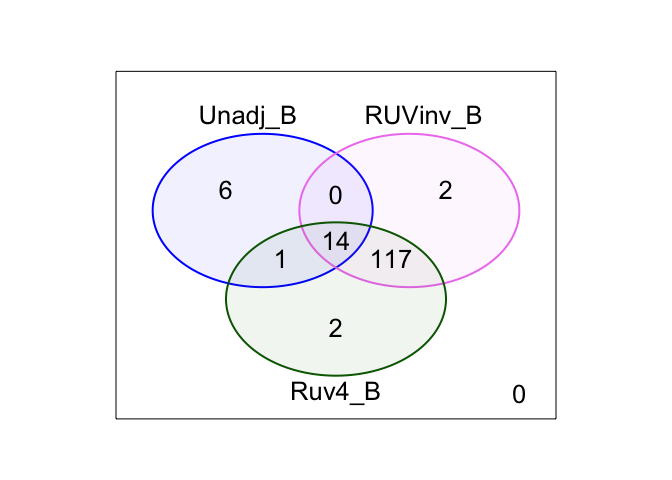
