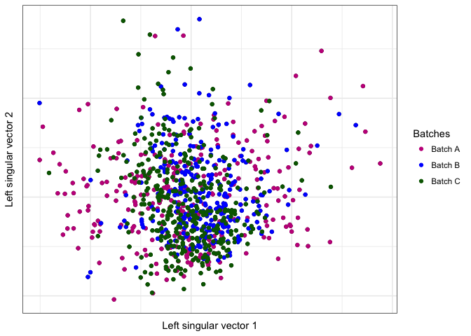
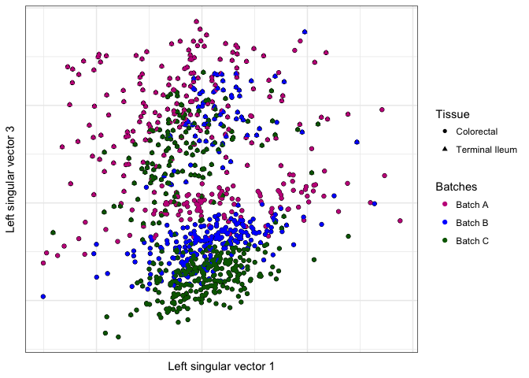
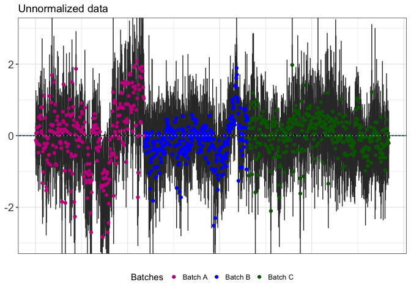
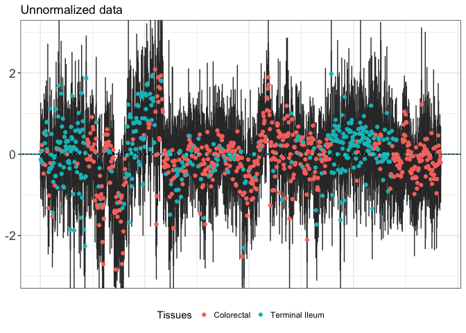
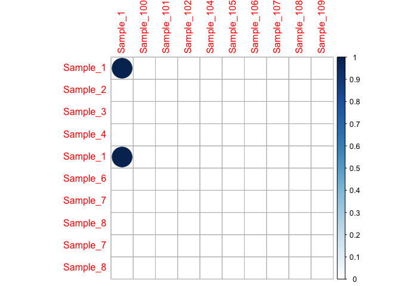
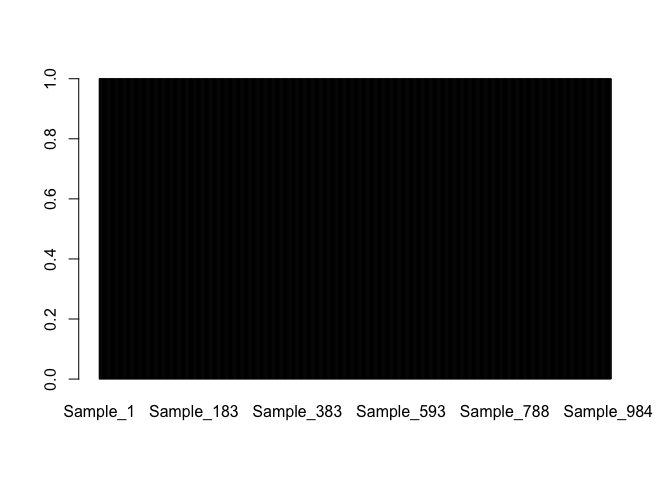
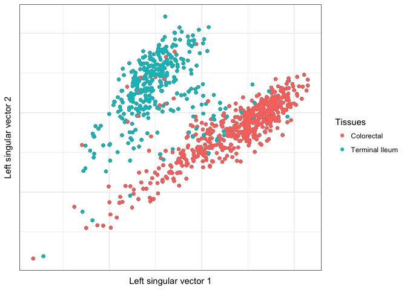

Removing unwanted variation - III (RUV-III)
================
Ramyar Molania and Anna Quaglieri

-   [Load expression data and samples information](#load-expression-data-and-samples-information)
-   [Visualise your data](#visualise-your-data)
    -   [Where `ruv` meets `ggplot`: `ruv::ruv_svdplot`](#where-ruv-meets-ggplot-ruvruv_svdplot)
    -   [Relative Log Expression (RLE) plots](#relative-log-expression-rle-plots)
    -   [Any questions?](#any-questions)
-   [Normalise your data](#normalise-your-data)
    -   [Build the matrix of replicates](#build-the-matrix-of-replicates)
    -   [RUV-III](#ruv-iii)
-   [RUV-III exercise](#ruv-iii-exercise)
-   [Session Info](#session-info)

``` r
library(ruv)
library(matrixStats)
library(ggplot2)
library(knitr)
library(corrplot)
```

    ## corrplot 0.84 loaded

Load expression data and samples information
============================================

``` r
ExpressionData <- read.csv("ExpressionData_RawData_Main.csv", stringsAsFactors = FALSE, 
    as.is = TRUE, row.names = 1)
dim(ExpressionData)
```

    ## [1] 698 959

``` r
ExpressionData <- as.matrix(log2(ExpressionData))
kable(ExpressionData[1:5, 1:5])
```

|         |  Sample\_1|  Sample\_2|  Sample\_3|  Sample\_4|  Sample\_1.1|
|---------|----------:|----------:|----------:|----------:|------------:|
| A3GALT2 |   5.000000|   4.643856|   3.584963|   4.700440|     4.523562|
| AAMP    |   8.379378|   8.988685|   8.651052|   9.238405|     8.954196|
| ABCB5   |   4.000000|   3.700440|   4.000000|   4.700440|     4.392317|
| ACCN5   |   3.584963|   3.321928|   3.584963|   4.169925|     4.906891|
| ACSL6   |   7.066089|   4.247928|   4.857981|   4.643856|     7.330917|

The gene expression data matrix contains 698 genes (rows) and 959 samples (columns). This data has been generated with the [Nanostring technology](https://www.nanostring.com/) which only targets up to 800 genes of interest.

``` r
SampleInformation <- read.csv("SampleInformation_Main.csv", stringsAsFactors = FALSE, 
    as.is = TRUE)
dim(SampleInformation)
```

    ## [1] 959   3

``` r
kable(head(SampleInformation))
```

| SamleIds  | Batch   | Tissue         |
|:----------|:--------|:---------------|
| Sample\_1 | Batch A | Terminal Ileum |
| Sample\_2 | Batch A | Colorectal     |
| Sample\_3 | Batch A | Terminal Ileum |
| Sample\_4 | Batch A | Colorectal     |
| Sample\_1 | Batch A | Terminal Ileum |
| Sample\_6 | Batch A | Colorectal     |

``` r
table(SampleInformation$Batch)
```

    ## 
    ## Batch A Batch B Batch C 
    ##     295     282     382

``` r
table(SampleInformation$Tissue)
```

    ## 
    ##     Colorectal Terminal Ileum 
    ##            565            394

The variable `Tissue` is the biology that we are interested in and we would expect that gene expression separates the different tissues. The variable `Batch` distinguishes samples processed with reagents bought at different times. The component of the regeants itself are the same but they were provided in different batches.

Visualise your data
===================

Where `ruv` meets `ggplot`: `ruv::ruv_svdplot`
----------------------------------------------

``` r
ColorBatch <- c("#c51b8a", "blue", "darkgreen")

ruv_svdplot(t(ExpressionData), k = c(1, 2), info = SampleInformation) + geom_point(aes(color = Batch)) + 
    scale_color_manual(values = ColorBatch) + labs(color = "Batches")
```



``` r
ruv_svdplot(t(ExpressionData), k = c(1, 2), info = SampleInformation) + geom_point(aes(color = Tissue)) + 
    labs(color = "Tissues")
```


``` r
ruv_svdplot(t(ExpressionData), k = c(1, 3), info = SampleInformation) + geom_point(aes(color = Batch, 
    shape = Tissue)) + scale_color_manual(values = ColorBatch) + labs(color = "Batches")
```



Relative Log Expression (RLE) plots
-----------------------------------

It is important to notice that a *bad looking* RLE plot means that there is unwanted variantion in your data but a *good looking* RLE plot does not necesserily mean that your data is correctly normalised. For more information about RLE plot see reference paper [RLE Plots: Visualising Unwanted Variation in High Dimensional Data](https://arxiv.org/abs/1704.03590), Luke C. Gandolfo, Terence P. Speed 2017.

In the plot below, medians have been highlited for better visualisation.

``` r
ColorBatch <- c("#c51b8a", "blue", "darkgreen")
ruv_rle(Y = t(ExpressionData), ylim = c(-3, 3), rowinfo = SampleInformation) + 
    geom_point(aes(x = rle.x.factor, y = middle, colour = Batch)) + theme(legend.position = "bottom") + 
    labs(colour = "Batches") + scale_color_manual(values = ColorBatch) + geom_hline(yintercept = 0, 
    linetype = "dotted", colour = "cyan") + ggtitle("Unnormalized data")
```



``` r
ruv_rle(Y = t(ExpressionData), ylim = c(-3, 3), rowinfo = SampleInformation) + 
    geom_point(aes(x = rle.x.factor, y = middle, colour = Tissue)) + theme(legend.position = "bottom") + 
    labs(colour = "Tissues") + geom_hline(yintercept = 0, linetype = "dotted", 
    colour = "cyan") + ggtitle("Unnormalized data")
```



Any questions?
--------------

Normalise your data
===================

Build the matrix of replicates
------------------------------

RUV-III performs normalisation by exploiting technical replicates which are replicates of the same biological sample. The function `ruv::replicate.matrix` will create a matrix with as many rows as the initial `SampleInformation` data frame and as many columns as the unique biological samples in the study. The order of the rows of `ReplicateMatrix` should be exactly the same as the order of the samples names in the `ExpressionData` matrix. The entries of the `replicate.matrix` are either 1 or 0 to indicate if two samples are or aren't replicates of one another.

``` r
table(SampleInformation$SamleIds)[table(SampleInformation$SamleIds) > 1]
```

    ## 
    ##   Sample_1 Sample_100 Sample_109 Sample_155 Sample_156 Sample_159 
    ##          3          2          2          2          2          4 
    ## Sample_168  Sample_18 Sample_184  Sample_20 Sample_207 Sample_208 
    ##          4          2          2          2          4          4 
    ## Sample_211 Sample_212 Sample_251  Sample_27  Sample_28 Sample_280 
    ##          3          4          2          2          2          2 
    ## Sample_295 Sample_342 Sample_343  Sample_51 Sample_512 Sample_523 
    ##          2          2          2          3          2          2 
    ##   Sample_7 Sample_726  Sample_76   Sample_8  Sample_92 Sample_952 
    ##          3          2          2          2          2          2 
    ##  Sample_99 
    ##          3

``` r
ReplicateMatrix <- replicate.matrix(SampleInformation$SamleIds)
dim(ReplicateMatrix)
```

    ## [1] 959 913

``` r
dim(SampleInformation)
```

    ## [1] 959   3

The number of technical replicates in the study can be found as the difference between the number of rows and columns of `ReplicateMatrix`. In this study there are 46 techical replicates.

The plot below is one way to understand how the matrix of replicates is structured. In the example below (a subset of `ReplicateMatrix`) one can see that rows 1 and 5 are replicates of the same sample `Sample_1` and therefore they have entry equal to 1.

``` r
rownames(ReplicateMatrix) <- SampleInformation$SamleIds
corrplot(ReplicateMatrix[1:10, 1:10], is.corr = FALSE)
```



Every row has always one entry equal to 1.

``` r
barplot(rowSums(ReplicateMatrix))
```



Every columns has at least one entry equal to 1. Samples with technical replicates will have more than one entry equal to 1.

``` r
barplot(colSums(ReplicateMatrix))
```


RUV-III
-------

Here, RUV-III is run with the maximum possible value of `k = 46` which is equal to the number of technical replicates within the study.

``` r
RUVcorrected <- RUVIII(Y = t(ExpressionData), M = ReplicateMatrix, ctl = c(1:nrow(ExpressionData)), 
    k = 46)
```

    ## Warning in RUVIII(Y = t(ExpressionData), M = ReplicateMatrix, ctl =
    ## c(1:nrow(ExpressionData)), : m is greater than n! This is not a problem
    ## itself, but may indicate that you need to transpose your data matrix.
    ## Please ensure that rows correspond to observations (e.g. microarrays) and
    ## columns correspond to features (e.g. genes).

Now we can visualise the data after correction and understand if we improved the data.

``` r
ruv_svdplot(RUVcorrected, k = c(1, 2), info = SampleInformation) + geom_point(aes(color = Tissue)) + 
    labs(color = "Tissues")
```


``` r
ColorBatch <- c("magenta", "blue", "darkgreen")
ruv_svdplot(RUVcorrected, k = c(1, 2), info = SampleInformation) + geom_point(aes(colour = Batch)) + 
    scale_color_manual(values = ColorBatch) + labs(color = "Batches")
```



``` r
ColorBatch <- c("#c51b8a", "blue", "darkgreen")
ruv_rle(Y = RUVcorrected, ylim = c(-3, 3)) + geom_point(aes(x = rle.x.factor, 
    y = middle, colour = SampleInformation$Batch)) + theme(legend.position = "bottom") + 
    labs(colour = "Batches") + scale_color_manual(values = ColorBatch) + geom_hline(yintercept = 0, 
    linetype = "dotted", colour = "cyan") + ggtitle("Normalized data with RUV-III")
```


RUV-III exercise
================

Now try to run `RUV-III` on the unnormalised data using different values for `k`. Try `k=1`, `k=10` and `k=20` and comment on the result by visualising the normalised data. Which one do you prefer? And why?

Session Info
============

``` r
sessionInfo()
```

    ## R version 3.5.0 (2018-04-23)
    ## Platform: x86_64-apple-darwin15.6.0 (64-bit)
    ## Running under: macOS Sierra 10.12.6
    ## 
    ## Matrix products: default
    ## BLAS: /Library/Frameworks/R.framework/Versions/3.5/Resources/lib/libRblas.0.dylib
    ## LAPACK: /Library/Frameworks/R.framework/Versions/3.5/Resources/lib/libRlapack.dylib
    ## 
    ## locale:
    ## [1] en_AU.UTF-8/en_AU.UTF-8/en_AU.UTF-8/C/en_AU.UTF-8/en_AU.UTF-8
    ## 
    ## attached base packages:
    ## [1] stats     graphics  grDevices utils     datasets  methods   base     
    ## 
    ## other attached packages:
    ## [1] here_0.1           corrplot_0.84      knitr_1.20        
    ## [4] ggplot2_2.2.1      matrixStats_0.53.1 ruv_0.9.7         
    ## 
    ## loaded via a namespace (and not attached):
    ##  [1] Rcpp_0.12.17     magrittr_1.5     munsell_0.4.3    colorspace_1.3-2
    ##  [5] rlang_0.2.1      highr_0.6        stringr_1.3.1    plyr_1.8.4      
    ##  [9] tools_3.5.0      grid_3.5.0       gtable_0.2.0     htmltools_0.3.6 
    ## [13] yaml_2.1.19      lazyeval_0.2.1   rprojroot_1.3-2  digest_0.6.15   
    ## [17] tibble_1.4.2     gridExtra_2.3    formatR_1.5      codetools_0.2-15
    ## [21] evaluate_0.10.1  rmarkdown_1.10   labeling_0.3     stringi_1.2.2   
    ## [25] compiler_3.5.0   pillar_1.2.3     scales_0.5.0     backports_1.1.2
